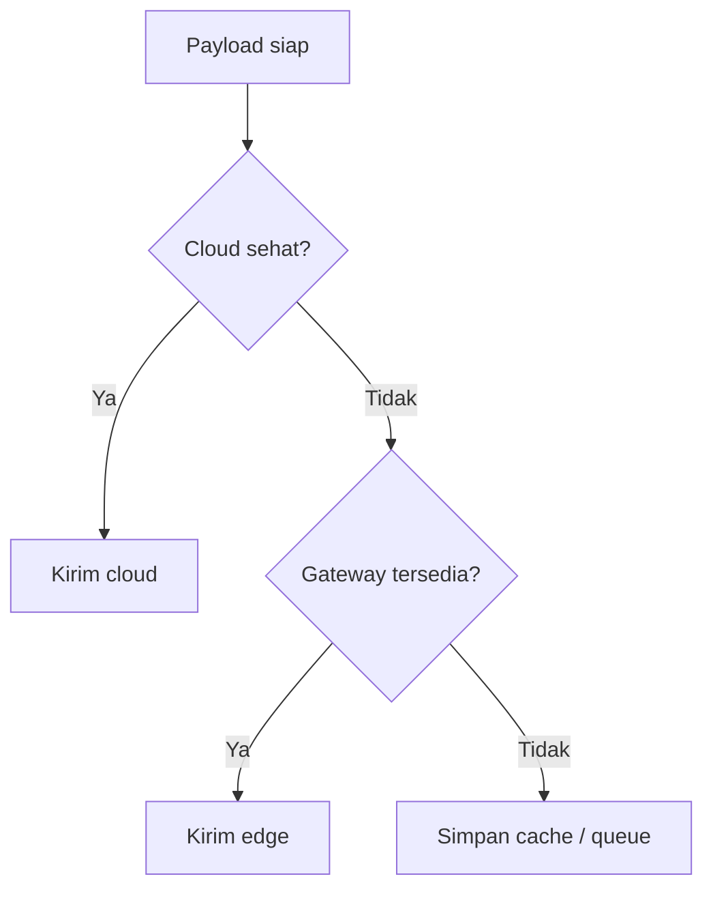

# Mode Auto

Mode auto berarti node dapat memilih cloud atau edge berdasarkan kondisi.

## Bukti dari Kode

`ApiClient.h` mendefinisikan `UploadMode::AUTO` sebagai automatic fallback. File yang sama juga memiliki fungsi untuk:

- memproses hasil gateway,
- mengecek mode gateway,
- menyelesaikan target upload queued atau immediate,
- mengatur fallback relay/cloud route,
- menghitung backoff.

## Alur Konsep

## Kenapa Auto Penting

Greenhouse tidak selalu punya koneksi internet stabil. Mode auto membantu node tetap mencoba jalur terbaik tanpa operator harus mengubah mode setiap kali jaringan berubah.

## Hal yang Harus Diverifikasi

- kapan cloud dianggap gagal,
- berapa kali gagal sebelum fallback,
- kapan cloud dicoba lagi,
- apakah data edge juga dikirim ulang ke cloud,
- bagaimana mode disimpan di konfigurasi,
- bagaimana terminal dapat mengubah mode.

Lanjutkan ke [Caching Local](./caching-local.md).
