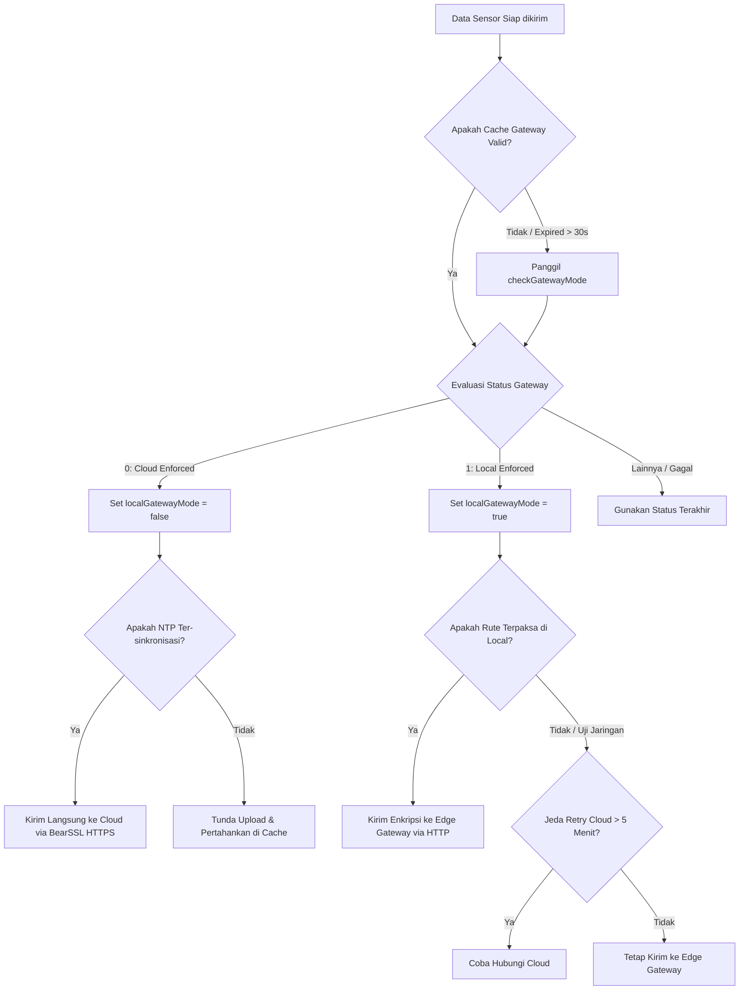

# Mode Auto (Dynamic Routing)

Mode Auto (`UploadMode::AUTO`) adalah mode pengiriman data bawaan (*default*) pada firmware Node ESP8266. Mode ini dirancang agar node dapat beradaptasi secara dinamis terhadap kondisi jaringan di area greenhouse dengan memilih jalur pengiriman terbaik secara otomatis antara Cloud (HTTPS langsung) dan Edge (HTTP lokal melalui Gateway).

---

## Mekanisme Kerja & Algoritma Routing

Ketika data sensor siap dikirim, [ApiClient](file:///home/dhimasardinata/Dokumen/ta/node/lib/NodeCore/api/ApiClient.h) mengevaluasi target pengiriman menggunakan fungsi [resolveQueuedUploadTarget](file:///home/dhimasardinata/Dokumen/ta/node/lib/NodeCore/api/ApiClient.UploadFlow.cpp#L246-L289).

Berikut adalah diagram alur keputusan penentuan rute pada Mode Auto:



### 1. Deteksi Keberadaan Gateway (Probing)
Node tidak terus-menerus memindai gateway untuk menghemat daya pemrosesan. Sistem menggunakan sistem *cache* status gateway:
- **Tenggat Waktu TTL (Time-To-Live):** Status gateway disimpan selama `GATEWAY_MODE_TTL_MS` (30.000 ms atau 30 detik).
- **Probing Aktif:** Jika status belum pernah di-probe atau sudah kadaluarsa (> 30 detik), node akan mengeksekusi `checkGatewayMode()`.
- **Status Respon Gateway:**
  - **`0` (Cloud Enforced):** Gateway memerintahkan node untuk mengirim langsung ke cloud. Rute lokal dinonaktifkan (`localGatewayMode = false`).
  - **`1` (Local Enforced):** Gateway memerintahkan node untuk mengirim data ke gateway. Rute lokal diaktifkan (`localGatewayMode = true`).
  - **`2` (Auto):** Fleksibilitas penuh diserahkan ke sisi node.
  - **`-1` (Fail):** Gateway tidak merespon, node menggunakan nilai status terakhir yang tersimpan di memori.

### 2. Pengalihan Rute Otomatis (Failover & Recovery)
- **Kondisi Normal (WiFi & Internet Sehat):** Node mengarahkan data secara langsung ke server cloud menggunakan protokol HTTPS terenkripsi.
- **Transisi ke Edge (Cloud Down/Internet Terputus):** Jika pengiriman ke cloud mengalami kegagalan berturut-turut, node akan mendeteksi gateway lokal. Jika gateway merespon dalam mode lokal (`gwMode == 1`), node akan beralih mengirimkan data ke IP gateway lokal secara terenkripsi (`localGatewayMode = true`).
- **Mekanisme Uji Pemulihan Jaringan (Cloud Recovery):** Saat berjalan dalam rute Edge Gateway, node tidak selamanya berada di mode lokal. Setiap interval `CLOUD_RETRY_INTERVAL_MS` (5 menit atau 300.000 ms), node akan mencoba mengirimkan satu paket data langsung ke Cloud. Jika pengiriman cloud tersebut sukses, node akan mengembalikan rute utama ke Cloud secara otomatis.

### 3. Batasan Waktu Backoff
Bila pengiriman data mengalami kegagalan (baik ke cloud maupun edge), sistem akan menghitung interval waktu tunggu pengiriman berikutnya (*backoff interval*). Interval ini meningkat secara eksponensial berdasarkan jumlah kegagalan beruntun, namun dibatasi oleh konstanta `MAX_BACKOFF_MS` sebesar **5 menit (300.000 ms)** untuk mencegah node berhenti mengirim data dalam waktu terlalu lama.

---

## Konfigurasi Melalui Terminal Diagnostik

Mode upload dapat dipantau dan diubah secara manual melalui [DiagnosticsTerminal](file:///home/dhimasardinata/Dokumen/ta/node/lib/NodeCore/terminal/DiagnosticsTerminal.h) dengan perintah `mode`:
- Periksa mode saat ini:
  ```bash
  mode show
  ```
- Paksa node ke Mode Auto:
  ```bash
  mode auto
  ```

Perubahan ini akan disimpan langsung ke dalam flash memori melalui [ConfigManager](file:///home/dhimasardinata/Dokumen/ta/node/lib/NodeCore/system/ConfigManager.h) sehingga konfigurasi tetap bertahan meskipun perangkat mengalami *reboot*.
