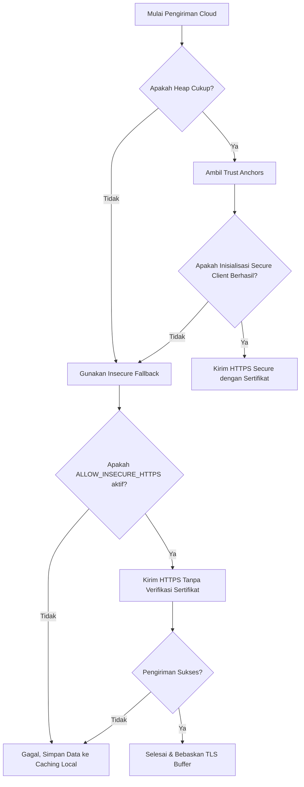

# Mode Cloud (Direct HTTPS Uplink)

Mode Cloud (`UploadMode::CLOUD`) memfokuskan pengiriman data sensor node ESP8266 secara langsung ke server cloud backend melalui protokol HTTPS terenkripsi. Pada mode ini, node tidak akan berupaya mendeteksi gateway lokal atau mengalihkan rute pengiriman data ke rute Edge, melainkan memaksa pengiriman langsung ke endpoint cloud eksternal.

---

## Mekanisme Keamanan & BearSSL TLS

Pengiriman data ke cloud menggunakan BearSSL [WiFiClientSecure](file:///home/dhimasardinata/Dokumen/ta/node/lib/NodeCore/api/ApiClient.h) yang terintegrasi di dalam library core ESP8266. Untuk dapat beroperasi dengan aman pada mikrokontroler dengan memori RAM yang terbatas, sistem menerapkan strategi manajemen memori dan keamanan sebagai berikut:

### 1. Alokasi Buffer TLS Dinamis
Untuk menghindari masalah fragmentasi memori (*heap fragmentation*) yang sering memicu *crash* pada ESP8266, ukuran buffer BearSSL diubah secara dinamis berdasarkan status pengiriman:
- **Buffer Mode Aktif (Saat Mengirim Data):** Mengalokasikan RX buffer sebesar `2048` byte dan TX buffer sebesar `1024` byte (`AppConstants::TLS_RX_BUF_SIZE` & `AppConstants::TLS_TX_BUF_SIZE`) untuk menampung respon HTTP header dari server cloud yang cukup besar.
- **Buffer Mode Idle / Portal:** Setelah pengiriman selesai, koneksi ditutup dan buffer dikurangi menjadi RX sebesar `512` byte dan TX sebesar `256` byte (`AppConstants::TLS_RX_BUF_PORTAL` & `AppConstants::TLS_TX_BUF_PORTAL`) demi menghemat memori RAM untuk tugas-tugas penanganan web portal lokal.

### 2. Autentikasi dan Tanda Tangan HMAC-SHA256
Setiap payload JSON yang akan dikirim ditandatangani secara kriptografis menggunakan algoritma **HMAC-SHA256**.
- **Kunci Token:** Menggunakan token upload rahasia yang disimpan dalam konfigurasi perangkat.
- **Hasil Tanda Tangan:** Hasil enkripsi HMAC-SHA256 dikonversi ke format string hexadecimal sepanjang 64 karakter.
- **Header Custom:** Tanda tangan tersebut disisipkan ke dalam request header bersamaan dengan identitas node untuk proses verifikasi di sisi cloud backend.

Berikut adalah daftar header khusus yang dikirimkan pada setiap request HTTPS Cloud:

| Nama Header | Deskripsi |
|---|---|
| `X-Device-ID` | ID perangkat unik (kombinasi MAC Address ESP8266) |
| `X-Node-ID` | Nama identitas node (misal: `node-1`) |
| `X-GH-ID` | Identitas Greenhouse tempat node terpasang |
| `X-Signature` | String tanda tangan hasil HMAC-SHA256 dari payload JSON |
| `X-Timestamp` | Epoch timestamp waktu pengambilan data (NTP synchronized) |

---

## Alur Penanganan Kegagalan & Fallback Insecure

Ketika pengiriman data cloud gagal karena kendala memori RAM yang tidak mencukupi atau fragmentasi, sistem menerapkan strategi pertahanan berlapis:

### Insecure Fallback
Jika memori bebas atau blok memori terbesar (*max free block*) berada di bawah batas minimal aman untuk melakukan verifikasi jabat tangan TLS yang aman (`AppConstants::TLS_MIN_SAFE_BLOCK_SIZE` / `AppConstants::TLS_MIN_TOTAL_HEAP`), sistem akan mengaktifkan rute **Insecure Fallback**.
1. Node melepaskan library sertifikat CA (`localTrustAnchors.reset()`) untuk membebaskan ruang memori.
2. Memanggil fungsi `setInsecure()` pada `WiFiClientSecure` untuk melewati proses verifikasi tanda tangan sertifikat SSL server.
3. Node memancarkan peringatan logs `[SEC] API TLS fallback to insecure` sekali saja (`tlsFallbackWarned` diset ke `true`) dan membroadcast status tersebut secara terenkripsi ke client diagnostics WebSocket.
4. Jika opsi `ALLOW_INSECURE_HTTPS` diaktifkan di konfigurasi, data dikirim secara non-verifikatif. Jika tidak, data langsung dialihkan ke penyimpanan [Caching Local](./caching-local.md) `/cache.dat`.
5. Semua sumber daya TLS yang dialokasikan segera dibebaskan setelah selesai melalui `releaseTlsResources()`.
