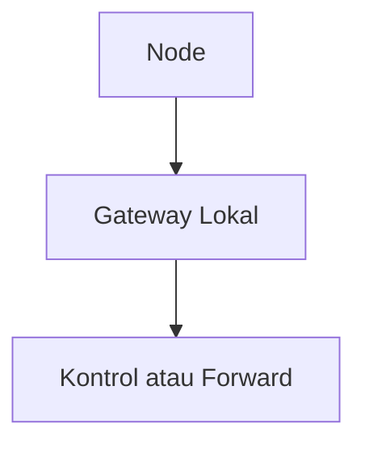

# Mode Edge

Mode edge berarti node memakai gateway lokal sebagai target utama.

## Bukti dari Kode

`ApiClient.h` memiliki `UploadMode::EDGE` dan fungsi local gateway seperti:

- `performLocalGatewayUpload`
- `buildLocalGatewayUrl`
- `checkGatewayMode`
- `isLocalGatewayActive`

Konstanta di `constants.h` juga menyebut:

- `LOCAL_GATEWAY_FALLBACK_THRESHOLD`
- `CLOUD_RETRY_INTERVAL_MS`
- `LOCAL_GATEWAY_PORT`
- `GATEWAY_MODE_PROBE_TIMEOUT_MS`

## Peran Edge

Edge berguna saat cloud lambat atau tidak tersedia. Gateway lokal dapat menerima data lebih dekat dengan node dan membantu sistem tetap bekerja di greenhouse.

## Alur Konsep

## Risiko

- gateway lokal mati,
- IP atau host gateway salah,
- mode gateway tidak terbaca,
- response gateway berbeda dari cloud,
- data bisa tertahan jika edge dan cloud sama-sama gagal.

## Catatan

Detail endpoint lokal dan format payload edge harus diverifikasi di file API client dan gateway.

Lanjutkan ke [Mode Auto](./mode-auto.md).
