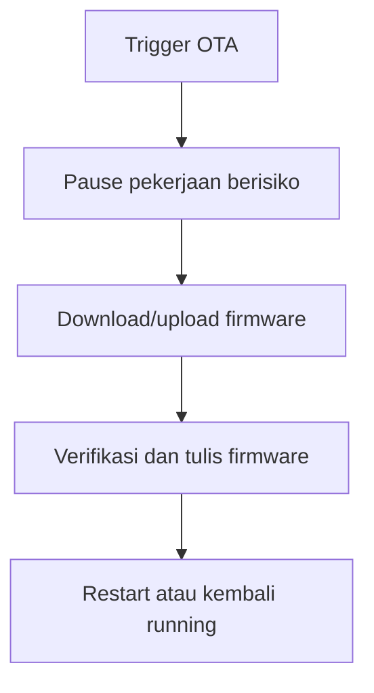

# OTA Update Node

OTA update pada node muncul dalam beberapa jalur: Arduino OTA, web OTA, dan cloud OTA.

## Bukti dari Kode

`Application.cpp` mengatur `ArduinoOTA` pada fase initializing. Saat OTA mulai, state berubah ke `UPDATING`; saat selesai atau error, state kembali ke `RUNNING`.

`AppServer.h` memiliki route upload OTA web dan callback pause/resume. Di `main.cpp`, callback OTA web mem-pause sensor dan API client saat upload berlangsung.

`OtaManager.h` menangani cloud OTA dengan:

- timer cek update,
- forced update check,
- forced insecure update,
- resource guard TLS,
- watchdog cloud OTA,
- parsing JSON OTA.

## Alur Konsep

## Timeout dan Watchdog

`constants.h` mendefinisikan timeout untuk:

- web OTA stall,
- web OTA maximum duration,
- Arduino OTA stall,
- Arduino OTA maximum duration,
- cloud OTA stall,
- cloud OTA maximum duration.

## Risiko

- firmware salah,
- koneksi putus,
- heap tidak cukup,
- TLS gagal,
- OTA stall,
- reboot saat upload belum selesai.

Lanjutkan ke [Debugging Node](./debugging-node.md).
