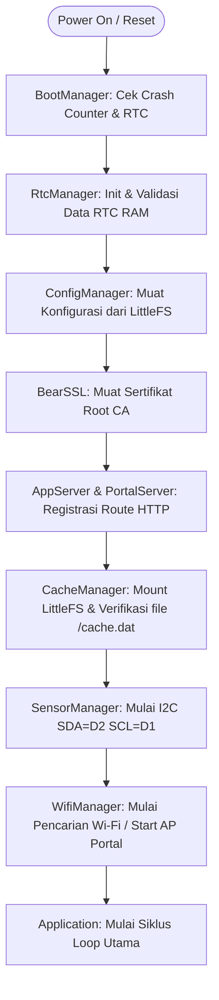

# Overview Firmware Node

Firmware node adalah program berbasis C++ (PlatformIO) yang berjalan di mikrokontroler ESP8266 pada perangkat sensor greenhouse. Peran utamanya adalah mengumpulkan data sensor lingkungan, mengelola koneksi Wi-Fi secara dinamis, menyediakan portal web lokal untuk konfigurasi, mengamankan transmisi data menggunakan TLS, menerapkan pengiriman data secara berkala ke Cloud atau Gateway lokal, serta menyimpan data di cache lokal LittleFS jika terjadi kegagalan jaringan.

## Arsitektur Penjadwalan: Cooperative Loop

Berbeda dengan sistem operasi real-time (RTOS) multitugas yang menggunakan *preemptive threading*, firmware node dirancang menggunakan metode **cooperative non-blocking loop**. Semua modul layanan berjalan pada thread tunggal di dalam `loop()` utama secara bergantian.

* **Tanpa Deep Sleep & Tanpa Baterai**: Karena perangkat disuplai oleh catu daya konstan AC-to-DC 5V 3A, node dirancang untuk selalu aktif (*active mode*) tanpa masuk ke mode *CPU deep sleep*.
* **Non-Blocking Execution & Yielding**: Untuk menjaga stabilitas memori stack dan memicu pengawas perangkat keras (*hardware watchdog*), setiap iterasi loop memanggil fungsi `yield()` secara berkala. Hal ini memberikan kesempatan bagi *background stack* ESP8266 (seperti Wi-Fi stack dan TCP connection handler) untuk memproses datanya tanpa menyebabkan sistem mengalami *hang* atau crash.

---

## Layanan Utama (Core Components)

Firmware ini disusun menggunakan beberapa komponen terintegrasi yang diinisialisasi di dalam `Runtime::init()` pada `node/src/main.cpp`:

1. **ConfigManager**: Mengelola penyimpanan konfigurasi sistem di flash memory LittleFS (termasuk Wi-Fi SSID, password, token, interval pengiriman, dan offset kalibrasi).
2. **SensorManager**: Menangani siklus inisialisasi, pembacaan berkala, dan pemulihan bus I2C dari sensor keluarga SHT melalui pustaka `SHTSensor` dan BH1750.
3. **WifiManager**: Mengelola status Wi-Fi STA (Station) untuk koneksi internet, Wi-Fi AP (Access Point) untuk portal lokal, dan transisi otomatis di antaranya.
4. **CacheManager**: Menyimpan data sensor secara sirkular dalam file biner `/cache.dat` di LittleFS jika jaringan terputus.
5. **NtpClient**: Menyinkronkan penanggalan internal dengan server waktu NTP sebagai stempel waktu (*timestamp*) pengiriman data.
6. **AppServer & PortalServer**: Menyediakan endpoint REST API dan portal web lokal captive portal untuk manajemen konfigurasi offline.
7. **ApiClient**: Mengatur proses serialisasi payload JSON, enkripsi BearSSL TLS, penandatanganan HMAC-SHA256, dan pengiriman ke server cloud atau gateway lokal.
8. **OtaManager**: Mengelola pembaruan firmware jarak jauh (*Over-the-Air*) secara aman.
9. **DiagnosticsTerminal**: Menyediakan antarmuka command line interface (CLI) interaktif melalui koneksi serial lokal maupun WebSocket.
10. **Application**: Pengatur mesin status (*state machine*) keseluruhan siklus aplikasi.

---

## Alur Inisialisasi Sistem (Setup Sequence)

Pada saat node diaktifkan pertama kali, BootManager akan memeriksa kondisi sistem. Jika sistem dinyatakan aman, inisialisasi dilanjutkan ke `Runtime::init()` dengan urutan sebagai berikut:

## Karakteristik Pemrosesan Data

Semua modul beroperasi secara asinkron menggunakan pengatur waktu interval non-blocking (`IntervalTimer`). Pembacaan fisik SHT dan BH1750 berjalan setiap 2 detik, sementara interval sampel/pengiriman payload mengikuti konfigurasi runtime (bawaan sampel 1 menit dan upload data 10 menit). Di dalam loop berjalan, jika jaringan tersedia, data dikirim menggunakan BearSSL HTTPS. Jika tidak tersedia, data dimasukkan ke dalam `CacheManager` untuk dikirim secara bertahap (*deferred upload*) di masa mendatang ketika koneksi pulih.

Lanjutkan ke bagian detail tentang **[Cara Kerja Node](./cara-kerja-node.md)** untuk melihat state machine lengkap dan detail eksekusinya.
