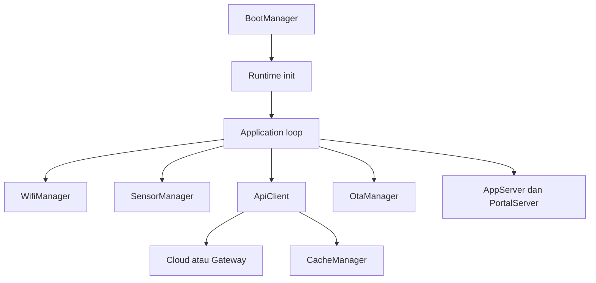

# Overview Firmware Node

Firmware node adalah program yang berjalan di perangkat sensor greenhouse. Perannya membaca sensor, mengelola Wi-Fi, menyediakan portal lokal, mengirim data ke cloud atau gateway, menyimpan cache ketika pengiriman gagal, dan mendukung OTA update.

## Bukti dari Kode

File `node/src/main.cpp` membuat satu struktur `Runtime` yang berisi layanan utama:

- `ConfigManager`
- `SensorManager`
- `WifiManager`
- `CacheManager`
- `NtpClient`
- `AppServer`
- `PortalServer`
- `ApiClient`
- `OtaManager`
- `DiagnosticsTerminal`
- `Application`

Urutan init di `Runtime::init()` menunjukkan pola besar: konfigurasi, TLS, web server, observer Wi-Fi, cache, sensor, Wi-Fi, NTP, API, OTA, terminal, lalu application loop.

## Peran Utama

1. Membaca sensor suhu, kelembapan, dan cahaya.
2. Menjaga koneksi Wi-Fi atau masuk portal mode.
3. Mengirim data sensor ke cloud atau gateway lokal.
4. Menyimpan data ke cache jika pengiriman belum berhasil.
5. Menyediakan terminal dan WebSocket lokal.
6. Menangani OTA dari web, Arduino OTA, dan cloud OTA.
7. Menjaga stabilitas dengan watchdog, health monitor, dan boot guard.

## Diagram Ringkas

## Catatan untuk Pemula

Firmware node tidak berjalan seperti aplikasi web yang menunggu klik pengguna. Firmware berjalan terus menerus di loop utama. Setiap modul harus dibuat ringan agar perangkat kecil seperti ESP8266 tetap stabil.

Lanjutkan ke [Cara Kerja Node](./cara-kerja-node.md).
