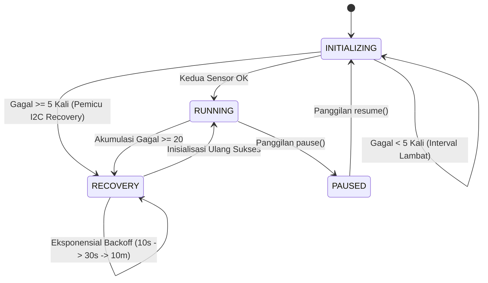

# Pembacaan Sensor & Pemulihan Bus I2C

Siklus hidup pengumpulan data sensor dikelola sepenuhnya oleh [SensorManager](file:///home/dhimasardinata/Dokumen/ta/node/lib/NodeCore/sensor/SensorManager.h) menggunakan komunikasi serial I2C. Komponen ini dirancang untuk beroperasi secara *non-blocking* dan dilengkapi fitur pemulihan bus otomatis (*stuck-bus recovery*) demi menjaga keandalan sistem dalam jangka panjang.

---

## Desain Arsitektur: CRTP (Compile-Time Polymorphism)

`SensorManager` mengimplementasikan pola **Curiously Recurring Template Pattern (CRTP)** dengan mewarisi kelas basis template [ISensorManager](file:///home/dhimasardinata/Dokumen/ta/node/lib/NodeCore/interfaces/ISensorManager.h):

```cpp
class SensorManager : public ISensorManager<SensorManager> {
  friend class ISensorManager<SensorManager>;
  // ...
};
```

Cara membacanya sederhana: `ISensorManager<SensorManager>` adalah kontrak umum, tetapi kontrak itu sudah tahu tipe konkret yang akan menjalankan pekerjaan sebenarnya, yaitu `SensorManager`. Karena tipenya diketahui saat build, pemanggilan seperti `readSensors()` dapat diarahkan ke `readSensorsImpl()` tanpa tabel fungsi virtual.

### Keuntungan Teknis CRTP:
*   **Tidak perlu `vptr` per objek**: Objek tidak membawa pointer virtual table seperti pada polymorphism runtime. Ini membantu firmware kecil karena RAM ESP8266 terbatas.
*   **Compile-Time Inlining**: Compiler C++ (PlatformIO / GCC) dapat menyisipkan kode fungsi (*inline*) selama kompilasi, sehingga panggilan fungsi di loop utama lebih ringan.
*   **Kontrak tetap terlihat jelas**: Kode lain tetap membaca interface `ISensorManager`, tetapi implementasi akhirnya tetap berada di `SensorManager`.

Pola yang sama juga muncul pada `CacheManager` dan `DiagnosticsTerminal` melalui interface CRTP lain. Untuk gambaran pola C++ lain yang dipakai firmware, lihat [Pola C++ di Firmware](../01-programming-and-concepts/cpp-patterns-firmware.md).

---

## Konfigurasi Perangkat Keras & Parameter I2C

Bus I2C diinisialisasi pada pin berikut:
*   **SDA**: `D2` (GPIO4)
*   **SCL**: `D1` (GPIO5)

Parameter komunikasi bus diatur secara ketat untuk mendeteksi kegagalan komunikasi dengan cepat:
1.  **Frekuensi Clock**: `100.000 Hz` (100 kHz Standard Mode).
2.  **Clock Stretch Limit**: Diatur ke `1000` (setara dengan batas waktu timeout ~1 ms pada arsitektur ESP8266). Jika sensor menahan jalur SCL (*stretching*) lebih dari 1 ms, ESP8266 akan membatalkan transaksi untuk mencegah sistem terkunci (*hang*).
3.  **Settle Delay**: Waktu tunggu stabilisasi bus setelah inisialisasi diatur sebesar `50 ms`.

---

## Siklus Status Sensor (State Machine)

`SensorManager` beroperasi di bawah 4 status internal:

1.  **`INITIALIZING`**: Status awal untuk mengaktifkan sensor. Jika sensor gagal terdeteksi dalam 5 kali percobaan berturut-turut, sistem akan memicu prosedur pemulihan bus I2C.
2.  **`RUNNING`**: Beroperasi normal secara berkala membaca sensor SHT31/SHT35 (suhu & kelembapan) dan BH1750 (intensitas cahaya).
3.  **`RECOVERY`**: Aktif ketika sensor mengalami kegagalan baca beruntun melampaui batas toleransi (`SENSOR_MAX_FAILURES = 20` kali). Memicu bit-bang pembersihan bus I2C.
4.  **`PAUSED`**: Menonaktifkan sementara pembacaan sensor dan interaksi bus I2C (biasanya digunakan selama proses penulisan flash memori intensif seperti OTA Update).



---

## Mekanisme Pemulihan Bus I2C (Stuck-Bus Recovery)

Ketika terjadi gangguan listrik sementara atau fluktuasi sinyal pada kabel sensor, perangkat slave (seperti SHT31 atau BH1750) dapat terjebak dalam kondisi mengirimkan bit data `0` (menahan jalur SDA tetap `LOW`). Karena mikrokontroler bertindak sebagai master dan hanya dapat mengontrol SCL, bus akan terkunci secara permanen tanpa adanya intervensi khusus.

Fungsi `recoverI2CBus()` pada [SensorManager.cpp](file:///home/dhimasardinata/Dokumen/ta/node/lib/NodeCore/sensor/SensorManager.cpp) melakukan pemulihan secara fisik melalui bit-banging:

1.  **Pelepasan Jalur**: Melepaskan pin SDA dan SCL ke mode input dengan pull-up eksternal (`INPUT_PULLUP`), lalu menunggu stabilitas bus selama `8 μs`.
2.  **Deteksi SCL Stuck**: Jika jalur SCL dibaca `LOW` setelah dilepaskan, bus dianggap mengalami kerusakan perangkat keras (korsleting atau kegagalan resistor pull-up). Sistem akan mencatat log error.
3.  **Bit-Bang SCL**: Jika SDA terdeteksi `LOW` (stuck) sedangkan SCL bernilai `HIGH`, master akan melakukan simulasi clock manual (bit-bang SCL) sebanyak maksimal **18 kali detak clock** (pulsa transisi `HIGH` -> `LOW` -> `HIGH` dengan jeda masing-masing `8 μs`). Tindakan ini memaksa slave untuk mengeluarkan bit data yang tersisa hingga slave melepaskan jalur SDA kembali ke tingkat `HIGH`.
4.  **Kondisi STOP Paksa**: Setelah jalur SDA berhasil dilepaskan, master akan mengirimkan sinyal `STOP` secara paksa (SDA ditransisikan dari `LOW` ke `HIGH` saat SCL bernilai `HIGH`) untuk mengembalikan status bus ke keadaan idle.
5.  **Inisialisasi Ulang Wire**: Memanggil ulang `Wire.begin(PIN_I2C_SDA, PIN_I2C_SCL)` dan mengonfigurasi ulang limit clock stretch.

---

## Kalibrasi, Validasi, dan Normalisasi Data

Setiap pembacaan mentah (*raw*) akan divalidasi dan dikalibrasi menggunakan metode statis dari pustaka pembantu [SensorNormalization.h](file:///home/dhimasardinata/Dokumen/ta/node/lib/NodeCore/sensor/SensorNormalization.h) sebelum dikirimkan ke cloud atau gateway.

### Batasan Nilai Default (Invalid Value)
Apabila sensor gagal dibaca atau status validitas bernilai `false`, sistem menetapkan konstanta penanda kegagalan:
*   **Suhu**: `-999.0f`
*   **Kelembapan**: `-999.0f`
*   **Cahaya**: `-1.0f`

### Rentang Normalisasi Matematis

Setiap data sensor memiliki batasan fisik yang ketat:

| Jenis Sensor | Rentang Batas Fisik | Representasi Desimal (*Tenths*) | Deskripsi |
| :--- | :--- | :--- | :--- |
| **Suhu (SHT)** | `[-40.0, 100.0] °C` | `[-400, 1000]` | Batas operasional ekstrem sensor suhu. |
| **Kelembapan (SHT)** | `[0.0, 100.0] %` | `[0, 1000]` | Persentase kelembapan relatif udara. |
| **Cahaya (BH1750)** | `[0.0, 65535.0] Lux` | N/A (Menggunakan Integer 16-bit) | Intensitas cahaya dalam satuan Lux. |

### Penerapan Formula Kalibrasi

Formulas kalibrasi menggunakan nilai offset (suhu/kelembapan) dan faktor pengali (cahaya) yang dikonfigurasi melalui `ConfigManager`:

$$\text{Suhu}_{\text{efektif}} = \text{Suhu}_{\text{raw}} + \text{Suhu}_{\text{offset}}$$

$$\text{Kelembapan}_{\text{efektif}} = \text{Kelembapan}_{\text{raw}} + \text{Kelembapan}_{\text{offset}}$$

$$\text{Cahaya}_{\text{efektif}} = \text{Cahaya}_{\text{raw}} \times \text{Cahaya}_{\text{faktor}}$$

Setelah nilai efektif dihitung, pustaka pembantu melakukan pembulatan bilangan ke bentuk integer tenths terdekat sebelum dimasukkan ke dalam format payload biner atau JSON:
*   **Suhu**: `roundToNearestInt(Suhu_efektif * 10.0f)` dan dibatasi ke rentang `[-400, 1000]`.
*   **Kelembapan**: `roundToNearestInt(Kelembapan_efektif * 10.0f)` dan dibatasi ke rentang `[0, 1000]`.
*   **Cahaya**: Dikonversi langsung ke integer 16-bit tanpa tanda (*uint16_t*) dan dibatasi ke rentang maksimum `65535U`.
