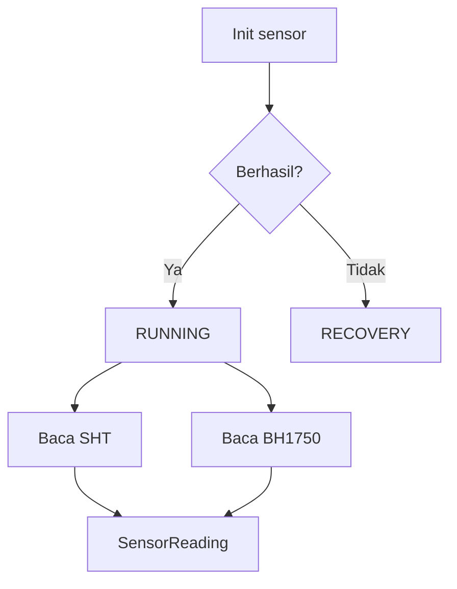

# Pembacaan Sensor

Pembacaan sensor dilakukan oleh `SensorManager`.

## Bukti dari Kode

File `node/lib/NodeCore/sensor/SensorManager.h` memakai:

- `BH1750` untuk sensor cahaya,
- `SHTSensor` untuk suhu dan kelembapan,
- `IntervalTimer` untuk interval baca,
- `SensorReading` untuk nilai plus status valid.

Konstanta dari `node/include/config/constants.h`:

| Konstanta | Nilai |
|---|---:|
| `BH1750_I2C_ADDR` | `0x23` |
| `SHT_READ_INTERVAL_MS` | `2000` |
| `BH1750_READ_INTERVAL_MS` | `2000` |
| `SENSOR_RECOVERY_INTERVAL_MS` | `10 * 60 * 1000` |
| `SENSOR_MAX_FAILURES` | `20` |

## State Sensor

`SensorManager` memiliki state:

- `INITIALIZING`
- `RUNNING`
- `RECOVERY`
- `PAUSED`

Artinya node tidak hanya membaca sensor, tetapi juga punya mekanisme recovery saat sensor gagal.

## Nilai Tidak Valid

Kode mendefinisikan:

- suhu invalid: `-999.0`
- kelembapan invalid: `-999.0`
- cahaya invalid: `-1.0`

Namun pembacaan juga memakai `SensorReading.isValid`, sehingga pembaca harus melihat status validitas, bukan hanya angka.

## Alur Konsep

## Catatan Debugging

Jika data sensor tidak masuk akal:

1. cek wiring I2C,
2. cek pin SDA/SCL,
3. cek log init sensor,
4. cek nilai `isValid`,
5. cek apakah sensor masuk recovery.

Lanjutkan ke [Mode Cloud](./mode-cloud.md).
