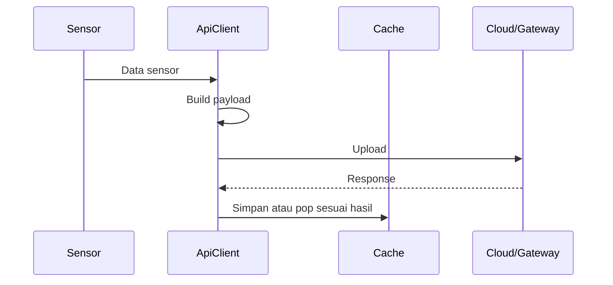

# Pengiriman Data

Pengiriman data dilakukan oleh `ApiClient`.

## Bukti dari Kode

`ApiClient.h` menunjukkan bahwa API client bertanggung jawab pada:

- payload buffer,
- immediate upload,
- queued upload,
- emergency queue,
- upload cloud/edge,
- QoS upload,
- TLS resource guard,
- local gateway fallback,
- signing payload dengan HMAC,
- WebSocket encrypted broadcast.

## Alur Konsep

## Faktor Keberhasilan

Upload berhasil jika:

- data sensor valid,
- payload dapat dibuat,
- heap cukup,
- Wi-Fi tersedia,
- TLS/HTTP siap,
- target menjawab dengan status yang diterima,
- cache pop berhasil jika data berasal dari cache.

## Error yang Mungkin Terjadi

- low memory,
- HTTP timeout,
- TLS gagal,
- target cloud gagal,
- gateway lokal tidak tersedia,
- response bukan sukses,
- payload terlalu besar,
- queue/caching gagal.

## Catatan untuk Pemula

Mengirim data dari perangkat kecil tidak sesederhana `kirim lalu selesai`. Firmware harus menjaga memori, jaringan, retry, cache, dan keamanan sekaligus.

Lanjutkan ke [WebSocket Local](./websocket-local.md).
