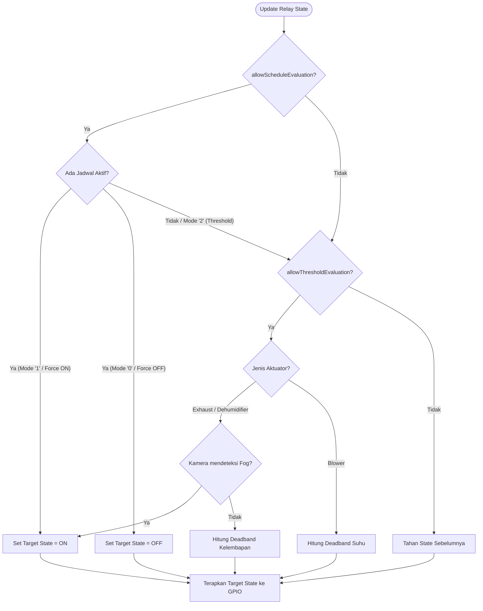

# Kontrol Aktuator dan Relay

Gateway mengontrol beban listrik AC tegangan tinggi (seperti kipas blower, exhaust fan, dan dehumidifier) menggunakan modul Relay 4-Channel. Penanganan perangkat keras relay ini diatur oleh komponen [RelayController](file:///home/dhimasardinata/Dokumen/ta/gateway/src/RelayController.cpp) secara asinkron dan kooperatif.

---

## Spesifikasi Pinout dan Pemetaan Greenhouse

Konfigurasi pin fisik untuk output relay dipetakan secara otomatis berdasarkan konstanta `GH_ID_CONFIG` yang dimuat dari build flag.

> [!WARNING]
> Pin Blower dan Unused diswap (ditukar) antara Greenhouse 1 dan Greenhouse 2 karena perbedaan desain tata letak kabel terminal PCB lapangan.

| Indeks Relay | Nama Aktuator | Pin Greenhouse 1 (`GH_ID_CONFIG == 1`) | Pin Greenhouse 2 (`GH_ID_CONFIG == 2`) |
| :--- | :--- | :--- | :--- |
| **`RELAY_EXHAUST` (0)** | Kipas Pembuangan (*Exhaust Fan*) | **GPIO 32** | **GPIO 32** |
| **`RELAY_DEHUMIDIFIER` (1)** | Penyerap Kelembapan (*Dehumidifier*) | **GPIO 33** | **GPIO 33** |
| **`RELAY_BLOWER` (2)** | Kipas Sirkulasi (*Blower*) | **GPIO 14** | **GPIO 12** |
| **`RELAY_UNUSED` (3)** | Cadangan (*Unused*) | **GPIO 12** | **GPIO 14** |

---

## Logika Kendali Digital: Active-Low

Relay yang digunakan pada sistem ini dikendalikan oleh driver transistor berbasis logika **Active-Low**.
* **Kondisi Aktif (ON)**: Mikrokontroler menulis logika `LOW` pada pin GPIO:
  ```cpp
  digitalWrite(pin, LOW);
  ```
  Ini mengalirkan arus ke optocoupler / koil relay, menghubungkan kontak terminal *Normally Open* (NO).
* **Kondisi Nonaktif (OFF)**: Mikrokontroler menulis logika `HIGH` pada pin GPIO:
  ```cpp
  digitalWrite(pin, HIGH);
  ```
* **Inisialisasi (`begin`)**: Saat Gateway booting, semua GPIO diatur sebagai `OUTPUT` dan langsung dipaksa ke logika `HIGH` agar semua aktuator mati secara aman sebelum konfigurasi selesai dimuat.

---

## Algoritma Keputusan Kontrol

Setiap siklus 5 detik (`LOOP_MS`), fungsi `updateSingleRelayState()` mengevaluasi kondisi sensor terhadap ambang batas dan jadwal secara berurutan (*priority matrix*):



### 1. Evaluasi Prioritas 1: Jadwal (*Schedules*)
Jika fitur jadwal aktif (`allowScheduleEvaluation` = true), Gateway mencocokkan jam dan menit saat ini dengan daftar jadwal di NVS.
* **Mode `'1'`**: Memaksa aktuator langsung **ON**, mengabaikan pembacaan sensor.
* **Mode `'0'`**: Memaksa aktuator langsung **OFF**, mengabaikan pembacaan sensor.
* **Mode `'2'`**: Mengembalikan kontrol ke sistem ambang batas (*threshold*).

### 2. Evaluasi Prioritas 2: Ambang Batas Sensor & Histeresis (*Deadband*)
Jika kontrol jatuh pada mode threshold (`allowThresholdEvaluation` = true), Gateway mengevaluasi sensor lingkungan dengan algoritma **deadband hysteresis** untuk mencegah aktuator menyala-mati berulang dalam waktu singkat (*chattering*):
* **Fungsi Histeresis**:
  ```cpp
  auto applyDeadband = [&](float val, float vMin, float vMax) -> bool {
      if (states[rI]) {
          return (val > vMin); // Tetap ON hingga nilai turun di bawah vMin
      }
      return (val >= vMax);    // Tetap OFF hingga nilai menyentuh/melebihi vMax
  };
  ```
* **Logika Exhaust & Dehumidifier (Evaluasi Kelembapan)**:
  * Diatur oleh kelembapan udara rata-rata.
  * **Interupsi Kamera**: Jika node kamera mendeteksi embun/kabut (`fog` = true), target otomatis dipaksa **ON** guna mempercepat pembersihan embun pada lensa kamera.
  * Jika tidak ada kabut, state ditentukan oleh `applyDeadband(hum, humidityMin, humidityMax)`.
* **Logika Blower (Evaluasi Suhu)**:
  * Diatur oleh suhu rata-rata menggunakan `applyDeadband(temp, tempMin, tempMax)`.

### 3. Evaluasi Prioritas 3: Penahanan State (*Hold*)
Jika data sensor usang (*stale*) atau server cloud tidak dapat dihubungi melebihi batas toleransi, fungsi kendali akan mempertahankan state terakhir yang diketahui (`states[rI]`) agar kestabilan tanaman tetap terjaga sampai masuk masa tenggang failsafe.

---

## Penanganan Keadaan Darurat (Failsafe)

Jika koneksi jaringan terputus total selama lebih dari 2 jam (`FAILSAFE_TIMEOUT_MS`), sistem masuk ke status **`forceSafeState()`**:
1. Menghapus dan menonaktifkan seluruh *manual override* yang aktif di RAM dan NVS.
2. Mematikan ketiga aktuator utama (`EXHAUST`, `DEHUMIDIFIER`, dan `BLOWER`) dengan menulis `HIGH` ke masing-masing GPIO.
3. Memastikan relay cadangan `RELAY_UNUSED` tetap dalam kondisi `HIGH` (mati).
4. Layar LCD akan menampilkan peringatan berkedip `** FAILSAFE **`.

Lanjutkan ke bagian **[SD Card Logging](./sd-card-logging.md)** untuk melihat bagaimana state aktuator dicatat secara fisik.
