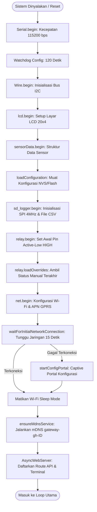

# Boot Sequence Gateway

Halaman ini mendokumentasikan urutan inisialisasi (*boot sequence*) yang terjadi saat perangkat Gateway ESP32 dinyalakan atau di-restart. Seluruh alur diatur dalam fungsi `setup()` pada file [main.cpp](file:///home/dhimasardinata/Dokumen/ta/gateway/src/main.cpp).

---

## Alur Inisialisasi Sistem (`setup`)

Urutan eksekusi *boot sequence* berjalan secara sekuensial melalui tahapan berikut:

---

## Rincian Setiap Tahap Booting

### 1. Inisialisasi Konsol Serial & Watchdog
* **Serial Terminal**: Mengaktifkan Serial hardware pada *baud rate* `115200` bps dan memberikan jeda toleransi koneksi serial selama 2 detik.
* **Hardware Watchdog (WDT)**:
  * Mengonfigurasi WDT menggunakan metode versi-spesifik. Pada ESP32 Arduino Core versi $\ge 3.0$, menggunakan `esp_task_wdt_reconfigure` untuk mengaktifkan trigger panic saat timeout. Pada versi lama, menggunakan `esp_task_wdt_init`.
  * Batas waktu reset diatur ke 120 detik (`WDT_TIMEOUT = 120`).
  * Mendaftarkan thread utama ke WDT via `esp_task_wdt_add(NULL)`.

### 2. Inisialisasi Perangkat Keras Lokal
* **Wire (I2C)**: Memulai I2C bus menggunakan `SDA_PIN` dan `SCL_PIN` yang terdefinisi pada hardware Gateway.
* **LCD Display**: Menghubungi layar LiquidCrystal_I2C pada alamat `0x27`. Jika layar terdeteksi, inisialisasi layout dilakukan; jika tidak, sistem menandai layar sebagai terputus (`LCDAvailability`) tanpa memblokir sistem.
* **Relay Controller**:
  * Menyetel pin-pin relay sesuai konfigurasi Greenhouse (`GH_ID_CONFIG`).
  * Menuliskan logika `HIGH` secara langsung (karena relay bertipe *Active-Low*, `HIGH` mematikan beban).
  * Memuat preferensi override manual terakhir dari namespace NVS `"relay-ovr"`.

### 3. File System & Penyimpanan Log
* **SD Card Logger**: Memulai bus SPI dengan clock frekuensi 4MHz pada pin `SCK=18`, `MISO=19`, `MOSI=13`, dan `CS=2` (atau pin CS sesuai rancangan hardware). Jika kartu SD terpasang, file `/log.csv` dan `/qos.csv` dibuka dalam mode *append*.

### 4. Setup Jaringan & Deteksi Failover Awal
* **Network Manager (`net.begin`)**: Mengumpankan variabel Wi-Fi (SSID, sandi), API token, URL tujuan cloud, serta parameter modem seluler GPRS (APN, User, Password, PIN SIM) ke pustaka `MyNetworkManager`.
* **Wait Window (`waitForInitialNetworkConnection`)**: Sistem memberikan jendela waktu tunggu (`kInitialNetworkConnectWindowMs` = 15.000 ms) agar salah satu koneksi (Wi-Fi STA atau GPRS) berhasil tersambung.
* **Captive Config Portal**: Jika dalam 15 detik perangkat tidak berhasil mendapatkan koneksi internet, sistem masuk ke mode aman dengan menjalankan Portal Web Konfigurasi lokal secara interaktif pada layar LCD. Gateway akan tetap berada di portal sampai pengguna menyimpan pengaturan Wi-Fi atau menekan tombol keluar.
* **WiFi Power Saving**: Mematikan fitur WiFi sleep mode dengan `WiFi.setSleep(false)` guna mengurangi latensi respons HTTP server lokal.
* **mDNS Service**: Mendaftarkan nama host mDNS lokal dengan format `gateway-gh-[ID_GREENHOUSE]`.

### 5. Registrasi Route REST API
Gateway mengaktifkan server web asinkron (`AsyncWebServer` pada Port 80) dengan endpoint kritis berikut:
* **`GET /api/mode`**: Mengembalikan status mode pengunggahan data saat ini (Cloud, Edge, atau Auto).
* **`GET /api/time`**: Sinkronisasi dan detail waktu RTC internal, konfigurasi zona waktu, server NTP, serta sumber sinkronisasi terakhir.
* **`GET /download?file=...`**: Endpoint khusus administrator untuk mengunduh log transaksi `/log.csv` dan kualitas koneksi `/qos.csv`. Akses ini dilindungi token admin, dan prosesnya akan menutup berkas logger sementara waktu (`sd_logger.closeFiles()`) untuk mencegah tabrakan akses write/read pada kartu SD.
* **`POST /api/data`**: Endpoint penerima data sensor yang dikirimkan oleh modul Node. Endpoint ini mencoba dekripsi payload AES-CBC jika format terenkripsi terdeteksi, melakukan validasi kecocokan ID Greenhouse (`GH_ID_CONFIG`), dan memasukkan data sensor tersebut ke dalam sistem.

Lanjutkan ke bagian **[Pengambilan Data](./pengambilan-data.md)** untuk melihat mekanisme penerimaan dan pemrosesan data sensor.
