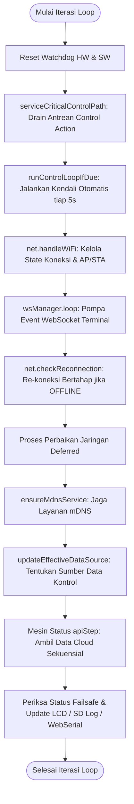

# Cara Kerja Gateway

Firmware Gateway berbasis ESP32 dirancang menggunakan arsitektur **cooperative time-sliced multitasking** pada satu core CPU utama. Gateway bertugas mengeksekusi kendali aktuator secara tepat waktu (setiap 5 detik) sekaligus mengelola komunikasi jaringan nirkabel (Wi-Fi/GPRS) yang cenderung memblokir proses. Untuk menjamin keandalan kontrol tanpa terganggu oleh latensi jaringan, firmware memisahkan pengambilan data Cloud menjadi mesin status bertahap (*multi-step state machine*) dan mengimplementasikan mekanisme interupsi kooperatif (*safety yield*).

---

## Alur Loop Utama (Cooperative Main Loop)

Siklus hidup loop utama diatur dalam `gateway/src/main.cpp` secara non-blocking. Berikut adalah urutan eksekusi berkala yang diproses dalam fungsi `loop()`:

Setiap komponen dirancang agar tidak menahan CPU (*non-blocking*), melainkan secara berkala membandingkan waktu saat ini (`millis()`) dengan penanda waktu terakhir untuk memutuskan apakah tugas tersebut sudah jatuh tempo.

---

## Mesin Status Pengambilan Data Cloud (`apiStep`)

Untuk mencegah pemblokiran CPU yang lama akibat request HTTP tunggal yang lambat, Gateway tidak mengambil seluruh data cloud dalam satu request besar. Prosedur sinkronisasi dibagi menjadi **4 langkah sekuensial** (`apiStep`) dengan jeda non-blocking sebesar **3 detik** di antara setiap langkah. Hal ini memberikan ruang bagi loop kendali untuk dieksekusi secara presisi pada intervalnya.

Mesin status dijalankan ketika flag `fetchTrigger` aktif (setiap 30 detik pada mode normal, atau lebih cepat jika dalam proses pemulihan jaringan/recovery):

1. **`apiStep = 1` (Fetch Node Data)**:
   * Mengirim HTTP POST ke endpoint cloud untuk mengambil data sensor dari node yang terdaftar.
   * Jika sukses, data diumpankan ke `applyCloudSensorSnapshot` dan state maju ke **`apiStep = 2`**.
   * Jika gagal, state direset ke **`apiStep = 0`** dan sinkronisasi awan dianggap gagal untuk iterasi ini.

2. **`apiStep = 2` (Fetch Thresholds)** (Dieksekusi setelah jeda $\ge 3000\text{ ms}$):
   * Mengirim HTTP GET untuk mengambil konfigurasi batas ambang batas (*threshold*) terbaru dari cloud.
   * Jika sukses, data diumpankan ke `applyCloudThresholdSnapshot`.
   * Jika sistem dalam mode pemulihan (`CLOUD_SYNC_RECOVERY`), sukses akan memajukan state ke **`apiStep = 3`**. Jika gagal, state direset ke **`apiStep = 0`** (gagal sinkronisasi).
   * Jika sistem dalam mode operasi normal:
     * Pada Greenhouse 2 (`GH_ID_CONFIG == 2`), state maju ke **`apiStep = 4`** (karena membutuhkan status kamera/fogger).
     * Pada Greenhouse 1 (`GH_ID_CONFIG == 1`), proses selesai, state kembali ke **`apiStep = 0`** dan dashboard diperbarui.

3. **`apiStep = 3` (Fetch Schedules - Khusus Recovery / GH2)** (Dieksekusi setelah jeda $\ge 3000\text{ ms}$):
   * Mengirim HTTP GET untuk mengambil jadwal aktuator (*schedules*) terbaru dari cloud.
   * Jika sukses, data disimpan ke NVS melalui `applyCloudScheduleSnapshot`.
     * Pada Greenhouse 2 (`GH_ID_CONFIG == 2`), state maju ke **`apiStep = 4`**.
     * Pada Greenhouse 1 (`GH_ID_CONFIG == 1`), proses selesai, status sukses dicatat, dan state kembali ke **`apiStep = 0`**.
   * Jika gagal, state direset ke **`apiStep = 0`** dan dicatat sebagai kegagalan cloud.

4. **`apiStep = 4` (Fetch Camera & Fogger Status - Khusus Greenhouse 2)** (Dieksekusi setelah jeda $\ge 3000\text{ ms}$):
   * Mengirim HTTP GET untuk mengambil status aktuasi kamera dan sistem pengabutan (*fogging status*).
   * Jika sukses, data diumpankan ke `applyCloudFogSnapshot`.
   * State kembali ke **`apiStep = 0`**, memperbarui dashboard via WebSocket, dan menandai selesainya seluruh rangkaian sinkronisasi.

---

## Manajemen Budget Waktu HTTP (`computeControlSafeHttpTimeout`)

Sebelum Gateway melakukan request HTTP/HTTPS ke luar, sistem akan menghitung secara dinamis batas waktu maksimum (*timeout budget*) yang aman agar request tersebut tidak menunda iterasi kendali berikutnya.

Fungsi `computeControlSafeHttpTimeout(nowMs, preferredTimeoutMs, sequentialRequestCount, extraOverheadMs)` menghitung sisa waktu sebelum control loop 5 detik jatuh tempo:

$$\text{msUntilNextControl} = \text{lastLoop} + \text{LOOP\_MS} - \text{nowMs}$$

Jika waktu yang tersisa kurang dari atau sama dengan batas aman (`CONTROL_LOOP_SAFETY_MARGIN_MS` = 750 ms), request HTTP **dibatalkan secara sepihak** (mengembalikan `0` ms) agar kontrol tetap berjalan tepat waktu.

Jika waktu masih cukup, budget dibagi berdasarkan jumlah request sekuensial yang direncanakan:

$$\text{perRequestBudget} = \frac{\text{msUntilNextControl} - \text{requiredReserve}}{\text{sequentialRequestCount}}$$

Jika hasil pembagian ini lebih kecil dari batas minimal kelayakan request (`HTTP_CONTROL_MIN_TIMEOUT_MS` = 1200 ms), request dibatalkan. Timeout ini diumpankan langsung ke client HTTP BearSSL TLS/WiFiClientSecure guna membatasi durasi jabat tangan TCP/TLS.

---

## Jalur Servis Kendali Kritis (`serviceCriticalControlPath`)

Selama pemrosesan request HTTP (yang bisa memakan waktu hingga beberapa detik pada koneksi seluler GPRS), loop utama tidak dapat berjalan. Untuk mengatasi hal ini, fungsi `serviceCriticalControlPath()` disisipkan di awal setiap langkah request HTTP.

Fungsi ini melakukan dua hal krusial:
1. **`processPendingControlActions()`**: Menguras dan memproses antrean aksi kendali (seperti perintah override dari web lokal atau update data sensor dari node) yang masuk melalui interupsi/asinkron.
2. **`runControlLoopIfDue(millis())`**: Memeriksa apakah interval 5 detik kendali aktuator telah terlampaui. Jika ya, ia akan mengeksekusi algoritma kendali di tengah-tengah pemrosesan jaringan.

Mekanisme *cooperative yielding* ini menjamin waktu tanggap aktuator fisik tetap berada pada orde milidetik, meskipun Gateway sedang melakukan komunikasi data yang intensif dengan server cloud.

Lanjutkan ke bagian **[Boot Sequence](./boot-sequence.md)** untuk melihat tahapan inisialisasi awal Gateway.
