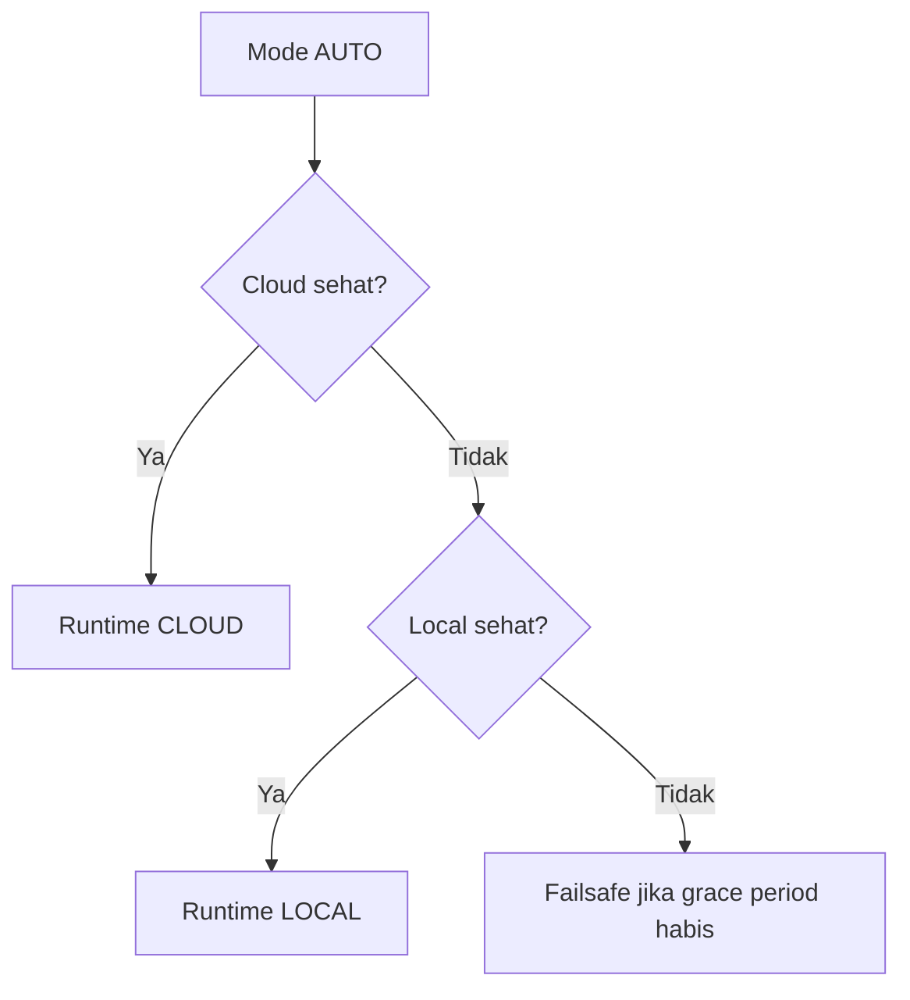

# Mode Auto Gateway

Mode auto memilih sumber runtime berdasarkan kesehatan cloud dan local.

## Bukti dari Kode

`GatewayControlState` menyimpan banyak indikator:

- `localDataUsable`,
- `cloudDataFresh`,
- `cloudThresholdFresh`,
- `cloudScheduleFresh`,
- `localControlHealthy`,
- `cloudControlHealthy`,
- `activeSourceHealthy`,
- `activeSourceStale`,
- `cloudSyncMode`.

`updateEffectiveDataSource()` memakai `resolveShouldUseLocalRuntime()` lalu menyimpan hasil ke `SensorDataManager`.

## Alur Konsep

## Hubungan dengan Failsafe

Jika tidak ada control path sehat dalam batas tertentu, `resolveShouldEnterFailSafe()` dapat membuat gateway masuk failsafe dan `relay.forceSafeState()` mematikan relay utama.

## Hal yang Perlu Dicek Saat Maintenance

- usia data cloud,
- usia data lokal,
- status threshold,
- status jadwal,
- status waktu RTC,
- mode konfigurasi,
- mode runtime.

Lanjutkan ke [Pengambilan Data](./pengambilan-data.md).
