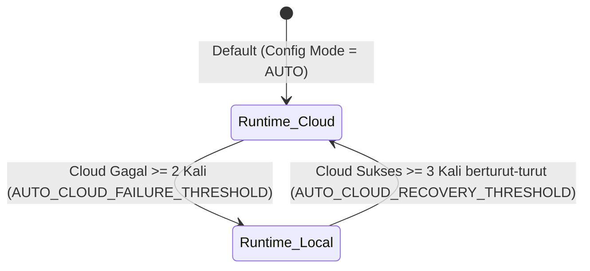
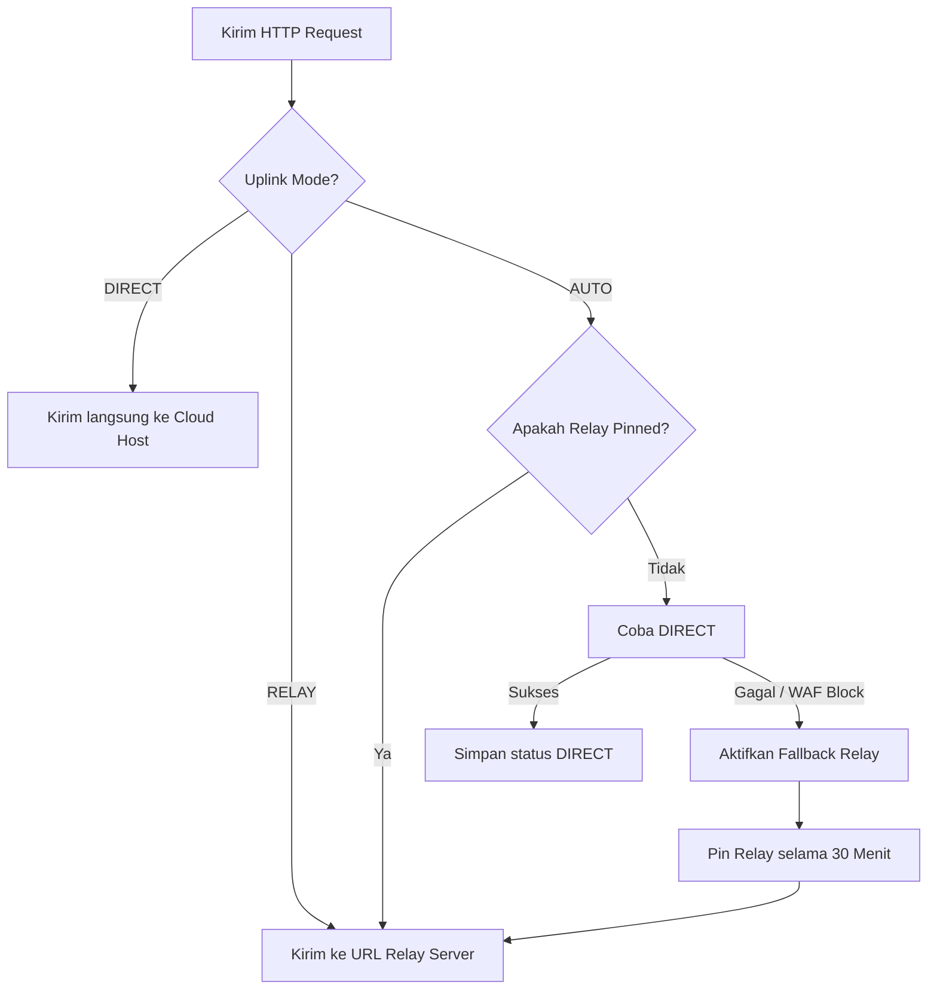

# Mode Auto & Sistem Failover Gateway

ESP32 Gateway dilengkapi dengan sistem manajemen jaringan dan keandalan kontrol otomatis bertingkat. Sistem ini terbagi menjadi dua mekanisme independen: **DataSourceMode** (sumber data runtime kontrol) dan **UplinkMode** (rute pengiriman paket internet).

---

## 1. DataSourceMode: Auto Cloud/Local Runtime

Variabel `DataSourceMode` menentukan sumber pembacaan sensor mana yang digunakan oleh driver relai untuk mengambil keputusan. Transisi antara sumber data `CLOUD` dan `LOCAL` diatur oleh logika berikut di dalam [GatewayControlState.cpp](file:///home/dhimasardinata/Dokumen/ta/gateway/src/GatewayControlState.cpp):

### Aturan Transisi:
*   **Keadaan Awal**: Gateway mencoba mengambil data sensor dari Cloud.
*   **Turun Kelas (Cloud ke Local)**: Jika koneksi API Cloud gagal sebanyak **2 kali berturut-turut** (`AUTO_CLOUD_FAILURE_THRESHOLD = 2`), atau data cloud dinyatakan stale (tidak segar), runtime secara otomatis beralih menggunakan rata-rata data lokal dari sensor node.
*   **Naik Kelas (Local ke Cloud)**: Selagi berjalan pada mode Lokal, gateway terus melakukan *background polling* ke cloud. Jika transaksi API ke cloud sukses sebanyak **3 kali berturut-turut** (`AUTO_CLOUD_RECOVERY_THRESHOLD = 3`) dan data dinyatakan segar, runtime beralih kembali ke mode Cloud.

---

## 2. UplinkMode: Auto Direct/Relay Routing

Variabel `UplinkMode` mengatur rute transmisi fisik paket data gateway menuju server API. Jalur default adalah `DIRECT`.

### Mekanisme Pinning Relay 30 Menit:
Jika gateway mendeteksi kegagalan koneksi langsung atau diblokir oleh WAF (*Web Application Firewall*), fungsi `activateRelayFallback()` akan berjalan:
1.  **Pinning**: Rute dialihkan ke relay server dan dikunci (*pinned*) selama **30 menit** (`RELAY_FALLBACK_PIN_MS = 1.800.000 ms`). Seluruh transaksi data berikutnya selama periode ini langsung dikirim ke URL relay (contoh: mengubah host menjadi sub-path `/relay-atomic/` atau `/relay-ta/`).
2.  **Pemulihan**: Setelah timer 30 menit kedaluwarsa, gateway akan mencoba jalur `DIRECT` kembali pada transaksi berikutnya. Jika berhasil, status fallback dibersihkan melalui `clearRelayFallback()`.

---

## 3. Jalur Koneksi Cadangan GPRS (Cellular Fallback)

Apabila jaringan utama Wi-Fi terputus secara permanen (melampaui `MAX_FAILURES_BEFORE_GPRS` percobaan), [MyNetworkManager.cpp](file:///home/dhimasardinata/Dokumen/ta/gateway/src/MyNetworkManager.cpp) mengalihkan kontrol fisik koneksi ke modul seluler SIM800L. Modul seluler ini diinisialisasi melalui mesin status bertahap `GprsSetupStage`:

### Tahapan Setup GPRS:
1.  `PROBE_AT`: Memeriksa respons komunikasi serial dengan mengirimkan perintah `AT`.
2.  `DISABLE_ECHO`: Mengirimkan perintah `ATE0` untuk mematikan echo serial.
3.  `ENABLE_LOCAL_TIME`: Mengaktifkan sinkronisasi waktu jaringan seluler (`AT+CLTS=1`).
4.  `CONFIGURE_CONTYPE`: Menyetel tipe koneksi data ke GPRS (`AT+SAPBR=3,1,"CONTYPE","GPRS"`).
5.  `CONFIGURE_APN`: Menyetel nama APN sesuai operator seluler yang terpasang.
6.  `CONFIGURE_USER` & `CONFIGURE_PASSWORD`: Memasukkan kredensial APN (jika ada).
7.  `CONFIGURE_PDP` & `ACTIVATE_PDP`: Membuka *Packet Data Protocol* context.
8.  `OPEN_BEARER` & `CHECK_BEARER`: Membuka pembawa data IP nirkabel.
9.  `ATTACH_GPRS`: Mendaftarkan modul ke layanan paket GPRS (`AT+CGATT=1`).
10. `CONFIGURE_CIPMUX` & `CONFIGURE_QUICKSEND` & `CONFIGURE_RXGET`: Mengatur mode soket TCP multi-koneksi dan penerimaan data asinkron.
11. `CONFIGURE_CSTT` & `BRING_UP_WIRELESS`: Mengaktifkan transmisi nirkabel dan memasukkan APN ke stack IP modem.
12. `QUERY_LOCAL_IP` & `CONFIGURE_DNS`: Meminta IP lokal dari BTS operator dan mendaftarkan DNS resolver.
13. `COMPLETE`: Koneksi data seluler siap digunakan untuk payload HTTP.

### Parameter Pemeliharaan GPRS:
*   **Health Polling**: Status koneksi diverifikasi secara aktif setiap **10 detik** (`kGprsHealthPollIntervalMs = 10.000 ms`).
*   **Signal Level**: Kekuatan sinyal (RSSI) dibaca berkala setiap **15 detik** (`kGprsSignalPollIntervalMs = 15.000 ms`).
*   **Session Validity**: Sesi GPRS dianggap aktif jika verifikasi konektivitas internet terakhir tidak lebih tua dari **30 detik** (`kGprsVerifiedMaxAgeMs = 30.000 ms`).

---

## 4. Mekanisme Failsafe Darurat (`forceSafeState()`)

Jika seluruh jalur data (baik lokal maupun cloud) mengalami gangguan total, gateway mengaktifkan protokol keamanan darurat untuk melindungi tanaman di dalam greenhouse.

### Syarat Masuk Failsafe:
*   Fungsi `resolveShouldEnterFailSafe()` mendeteksi bahwa data lokal tidak tersedia, data cloud tidak segar, dan tidak ada sumber kontrol alternatif yang sehat.
*   Kondisi tidak sehat ini berlangsung terus-menerus melebihi batas toleransi **30 detik** (`CONTROL_SOURCE_LOSS_FAILSAFE_MS = 30.000 ms`).

### Tindakan Failsafe:
Driver relai akan memanggil fungsi `forceSafeState()` yang secara instan mengirimkan sinyal kontrol fisik:
*   Karena relai menggunakan logika **Active-Low**, pin GPIO yang terhubung ke relai utama (Exhaust, Dehumidifier, Blower) ditarik ke logika **HIGH** (artinya mematikan saklar listrik).
*   Layar LCD 20x4 menampilkan baris peringatan berkedip: `** FAILSAFE **`.

Mekanisme ini mencegah kipas blower atau exhaust menyala tanpa kendali dalam durasi lama yang dapat memicu korsleting listrik atau kerusakan struktur greenhouse.

Lanjutkan ke [Pengambilan Data](./pengambilan-data.md) untuk melihat skema penyimpanan SensorDataManager.
