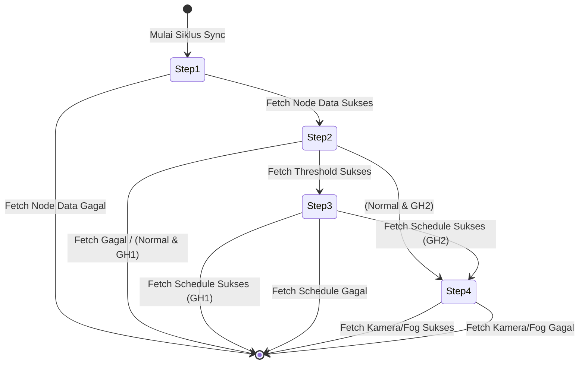

# Mode Cloud Gateway

Mode Cloud merupakan mode operasi di mana ESP32 Gateway memposisikan server cloud sebagai sumber data sensor (*source of truth*) dan konfigurasi kontrol utama. Dalam mode ini, keputusan relay, jadwal, dan threshold didasarkan pada data terenkripsi yang disinkronisasikan dari API server cloud secara berkala.

## Arsitektur Sinkronisasi API Cloud

Gateway secara aktif melakukan sinkronisasi data dari cloud menggunakan protokol HTTP dengan batasan ketat untuk memastikan keandalan pada lingkungan jaringan IoT yang tidak stabil.

### Konfigurasi & Endpoint NVS

Endpoint dan token autentikasi disimpan di dalam flash non-volatile storage (NVS) pada namespace `"device-config"`. Variabel ini dapat diperbarui secara dinamis melalui portal konfigurasi lokal atau WebSerial:

*   `cfg_th_url` / `TH_URL`: Endpoint untuk mengambil batas threshold suhu, kelembapan, dan cahaya.
*   `cfg_nd_url` / `ND_URL`: Endpoint untuk mengambil snapshot pembacaan data sensor dari server.
*   `cfg_schedule_url`: Endpoint untuk menyinkronkan jadwal kontrol relai dari cloud.
*   `cfg_auth_token` / `cfg_ta_token`: Token JWT Bearer untuk autentikasi API.

### Struktur HTTP Request

Untuk meminimalkan potensi kegagalan koneksi (*socket leak* atau *EOF error -29312*) pada modul GPRS/Wi-Fi, class [MyNetworkManager.cpp](file:///home/dhimasardinata/Dokumen/ta/gateway/src/MyNetworkManager.cpp) memaksa konfigurasi HTTP berikut:

1.  **HTTP/1.0 Protocol**: Memanggil `http.useHTTP10(true)` untuk menonaktifkan *transfer-encoding: chunked* yang sering kali tidak didukung dengan baik oleh library networking ESP32 dalam skenario koneksi seluler.
2.  **Connection Close**: Header `Connection: close` ditambahkan secara eksplisit untuk memaksa soket langsung ditutup setelah transaksi selesai.
3.  **Custom Headers**: Setiap request menyertakan header identifikasi perangkat:
    *   `Authorization: Bearer <token>`
    *   `User-Agent: ESP32-Gateway/<version>`
    *   `X-Device-ID: <MAC_Address>`
    *   `Content-Type: application/json` (jika mengirimkan payload)

---

## State Machine Pengambilan Data (`apiStep`)

Proses pengambilan data dari cloud tidak dilakukan sekaligus untuk menghindari pemblokiran *loop* utama dan menghemat RAM. Gateway menggunakan *state machine* bertahap yang dilacak melalui variabel `apiStep` di dalam [main.cpp](file:///home/dhimasardinata/Dokumen/ta/gateway/src/main.cpp) pada fungsi `serviceCriticalControlPath()`:



### Detail Langkah Sinkronisasi

1.  **Langkah 1: Fetch Node Data (`fetchNodeData()`)**
    *   Mengambil snapshot data sensor terbaru yang diterima cloud dari seluruh node sensor.
    *   Jika berhasil, data disimpan ke dalam `CloudSensorSnapshot` dan lanjut ke Langkah 2. Jika gagal, siklus dihentikan untuk mencegah data yang tidak konsisten.
2.  **Langkah 2: Fetch Thresholds (`fetchThresholds()`)**
    *   Jeda waktu 3 detik diberikan sebelum pemanggilan untuk mencegah kongesti soket.
    *   Mengambil konfigurasi batas threshold operasional (suhu, kelembapan, cahaya).
    *   Jika berhasil, snapshot disimpan ke `CloudThresholdSnapshot`. Jika gateway dikonfigurasi untuk GreenHouse 2 (GH2), alur berlanjut ke Langkah 4. Jika GreenHouse 1 (GH1), alur berlanjut ke Langkah 3.
3.  **Langkah 3: Fetch Schedules (`fetchSchedules()`)**
    *   Jeda waktu 3 detik diberikan.
    *   Mengambil konfigurasi jadwal (*scheduler*) aktivasi relai.
    *   Jika berhasil, data disimpan ke `CloudScheduleSnapshot` dan langsung diterapkan ke driver relai. Jika gateway berjalan di GH2, alur lanjut ke Langkah 4.
4.  **Langkah 4: Fetch Camera/Fog Status (`fetchCameraStatus()`) - Khusus Greenhouse 2**
    *   Jeda waktu 3 detik diberikan.
    *   Mengambil status kondisi *fogging* terbaru dari kamera pengawas.
    *   Setelah langkah ini selesai, status `apiStep` direset kembali ke 0.

---

## Struktur Data Cloud Snapshot

Data yang berhasil diunduh diparsing menggunakan `ArduinoJson` ke dalam struktur memori internal sebelum diterapkan ke sistem kontrol:

```cpp
struct CloudSensorSnapshot {
    bool valid = false;
    bool controlReady = false;
    bool hasTemp = false;
    float temp = 0.0f;
    bool hasHum = false;
    float hum = 0.0f;
    bool hasLight = false;
    float light = 0.0f;
};

struct CloudThresholdSnapshot {
    bool valid = false;
    float tempMin, tempMax;
    float humMin, humMax;
    float lightMin, lightMax;
};
```

> [!WARNING]
> Jika data cloud yang diterima tidak lolos validasi struktur JSON (misalnya nilai sensor berada di luar rentang rasional seperti suhu > 100°C), gateway akan mengabaikan payload tersebut (`Invalid cloud payload ignored`) dan tetap mempertahankan snapshot sehat terakhir untuk menjaga stabilitas kontrol greenhouse.

Lanjutkan membaca mengenai [Mode Edge](./mode-edge.md) untuk memahami bagaimana gateway beroperasi secara lokal tanpa koneksi cloud.
