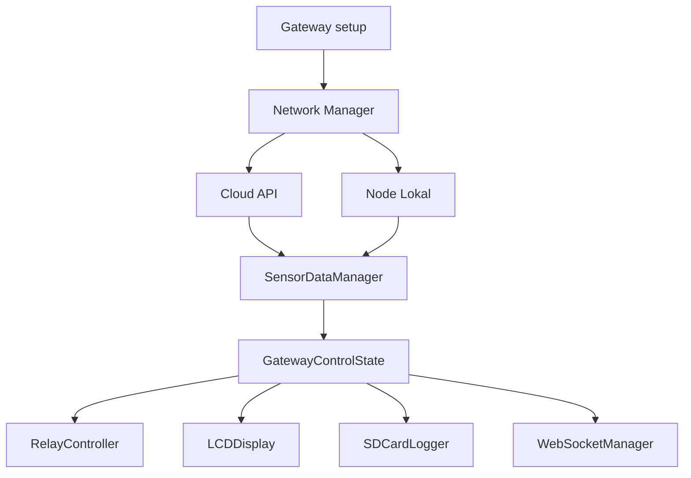

# Overview Firmware Gateway

Firmware gateway adalah program yang berjalan di ESP32/TTGO T-Call. Gateway menjadi pusat kendali lokal greenhouse: mengambil data, memilih sumber data runtime, mengendalikan relay, menulis log SD Card, menampilkan status LCD, menyediakan WebSocket/terminal, dan menjaga koneksi Wi-Fi/GPRS.

## Bukti dari Kode

`gateway/src/main.cpp` membuat object global:

- `LCDDisplay lcd`
- `SensorDataManager sensorData`
- `SDCardLogger sd_logger`
- `RelayController relay`
- `MyNetworkManager net`
- `RTCManager rtc_mgr`
- `AsyncWebServer server`
- `WebSocketManager wsManager`

File `gateway/include/config.h` mendefinisikan pin modem SIM800L, SD Card, relay, I2C LCD/RTC, endpoint API, token default, timeout, watchdog, dan interval WebSocket.

## Peran Utama

1. Menjaga jaringan Wi-Fi dan fallback GPRS.
2. Mengambil data sensor, threshold, jadwal, dan status kamera dari cloud.
3. Menerima data node lokal melalui endpoint gateway.
4. Menghitung rata-rata lokal dari node aktif.
5. Memilih runtime data source: cloud, local, atau auto fallback.
6. Mengendalikan relay exhaust, dehumidifier, dan blower.
7. Menulis log data dan QoS ke SD Card.
8. Menampilkan status ke LCD 20x4.
9. Melayani dashboard/terminal lokal via WebSocket.

## Diagram Ringkas

Lanjutkan ke [Cara Kerja Gateway](./cara-kerja-gateway.md).
