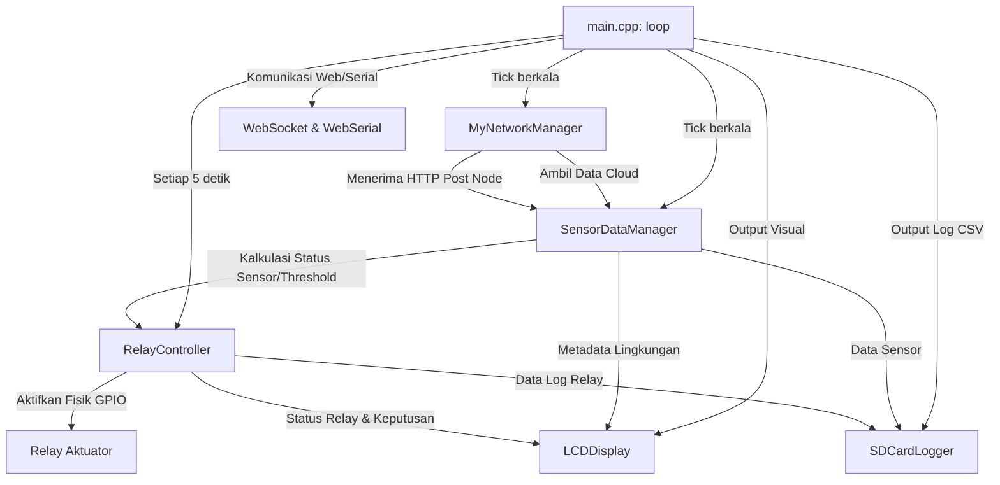

# Overview Firmware Gateway

Firmware gateway adalah program pusat kendali lokal yang dirancang khusus untuk berjalan pada mikrokontroler **ESP32** (menggunakan modul TTGO T-Call V1.3/V1.4). Perangkat ini bertindak sebagai jembatan cerdas (*intelligent edge router*) dan pengambil keputusan otonom untuk sistem otomatisasi iklim mikro di dalam greenhouse.

Gateway bertugas mengoordinasikan pembacaan data sensor dari node-node lokal, memvalidasi dan memproses data tersebut, mengambil kebijakan dari cloud, mengendalikan aktuator fisik (relay), menulis log data ke penyimpanan lokal (SD Card), menampilkan status operasional pada LCD, serta menyediakan dasbor kontrol lokal melalui protokol WebSocket dan terminal WebSerial.

---

## Arsitektur Penjadwal Kooperatif (*Cooperative Scheduler*)

Firmware gateway memakai **penjadwal kooperatif berbasis *non-blocking loop*** di dalam fungsi utama `loop()` untuk sebagian besar pekerjaan runtime yang berulang.

Sistem ini mengurangi risiko *race conditions* atau tabrakan akses memori (misalnya pada bus SPI atau I2C) dengan cara membagi pengerjaan tugas (*task slicing*) secara kooperatif. Operasi penulisan LCD, pembacaan SD Card, pengiriman data API, dan kontrol aktuator berjalan bergiliran pada thread utama. Beberapa `delay()` tetap ada secara terbatas di tahap setup, recovery, dan operasi khusus seperti yield memori jaringan.

Setiap modul dirancang untuk menyerahkan kembali kontrol ke loop utama secepat mungkin. Jika suatu operasi jaringan (seperti koneksi HTTP) membutuhkan waktu tunggu, sistem akan membagi request tersebut menjadi beberapa langkah mesin status (*state machine*) dan secara berkala memanggil fungsi pengaman `serviceCriticalControlPath()` agar jalur kendali relay tetap berjalan tepat waktu tanpa terganggu oleh kendala latensi internet.

---

## Objek Global Utama

Arsitektur perangkat lunak gateway diorganisasikan di dalam berkas [main.cpp](file:///home/dhimasardinata/Dokumen/ta/gateway/src/main.cpp) dengan instansiasi beberapa objek global utama berikut:

- **`MyNetworkManager net`**: Mengelola siklus koneksi Wi-Fi STA/AP, *fallback* GPRS via modem SIM800L, parsing DNS, dan penanganan panggilan API ke cloud (Threshold, Jadwal, Kamera, Status Device).
- **`SensorDataManager sensorData`**: Menyimpan dan memproses basis data sensor dari cloud maupun node lokal, menghitung rata-rata lokal otonom, dan mengoordinasikan transisi antara sumber data cloud dan lokal.
- **`RelayController relay`**: Mengatur kondisi logika fisik pin GPIO relay (Active-Low) berdasarkan hasil evaluasi gabungan antara batas threshold sensor dan jadwal operasional.
- **`SDCardLogger sd_logger`**: Melakukan pencatatan data lingkungan secara periodik ke berkas `/log.csv` dan log kualitas layanan telemetri ke berkas `/qos.csv` melalui bus SPI 4MHz.
- **`LCDDisplay lcd`**: Mengelola antarmuka layar karakter LiquidCrystal I2C 20x4 untuk pemantauan parameter sensor, status jaringan (WF/GP), dan status relay secara *live*.
- **`RTCManager rtc_mgr`**: Sinkronisasi dan penyediaan waktu presisi berpresisi tinggi (menggunakan NTP, API WorldTime, atau jaringan GSM) yang didukung oleh chip hardware RTC eksternal.
- **`WebSocketManager wsManager`**: Menyediakan dasbor diagnostik interaktif berbasis web lokal dan mengoordinasikan pertukaran data JSON terenkripsi secara *real-time*.
- **`AsyncWebServer server`**: Web server asinkron yang melayani halaman konfigurasi portal, API endpoints, WebSerial admin, dan jalur pembaruan firmware (OTA).

---

## Konfigurasi Pin Hardware dan Parameter Pusat

Semua pemetaan fisik pin GPIO mikrokontroler ESP32, batas timeout jaringan, parameter pengaman WDT (Watchdog Timer), serta interval pemicu *polling* data didefinisikan secara terpusat di dalam berkas konfigurasi [config.h](file:///home/dhimasardinata/Dokumen/ta/gateway/include/config.h).

Pengaturan penting dalam [config.h](file:///home/dhimasardinata/Dokumen/ta/gateway/include/config.h) meliputi:
- **I2C Bus**: Menggunakan pin `SDA_PIN = 21` dan `SCL_PIN = 22`.
- **SPI SD Card**: Menggunakan pin `SD_CS = 2`, `SD_SCK = 18`, `SD_MISO = 19`, dan `SD_MOSI = 13`.
- **Modem SIM800L**: Menggunakan pin `GSM_TX = 26`, `GSM_RX = 27`, PWKEY `GSM_PWR = 4`, dan RESET `GSM_RST = 5`.
- **Watchdog Timer**: Diatur pada `WDT_TIMEOUT = 120` detik untuk memastikan ESP32 melakukan *reboot* otomatis jika sistem mengalami *hang* atau kebuntuan loop.

---

## Diagram Alur Arsitektur Gateway

Aliran data dan hubungan antar komponen utama diilustrasikan pada diagram berikut:

Lanjutkan ke penjelasan detail mengenai mesin status penanganan tugas di [Cara Kerja Gateway](./cara-kerja-gateway.md).
