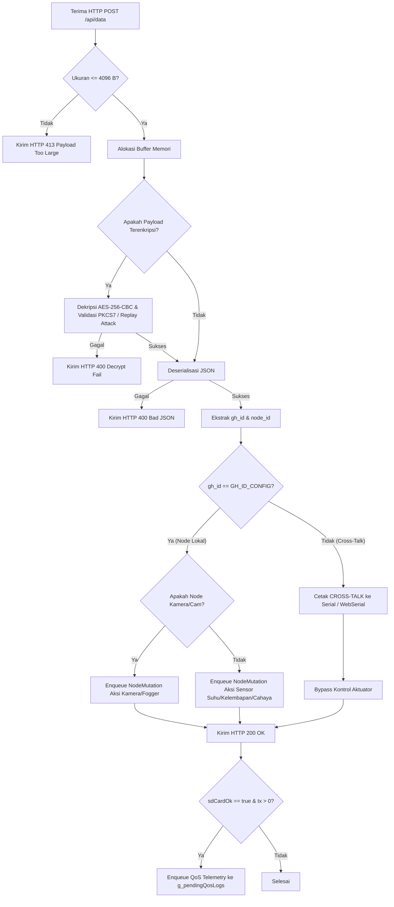

# Pengambilan dan Ingesti Data

Gateway mengintegrasikan dua jalur utama untuk memperoleh data lingkungan: **ingesti data lokal** (menerima laporan nirkabel dari Node Sensor via HTTP POST) dan **sinkronisasi awan** (mengunduh data target kontrol dari Web API Cloud secara bertahap).

---

## 1. Ingesti Data Lokal (HTTP POST `/api/data`)

Modul Node mengirimkan pembacaan sensornya dengan mengirimkan HTTP POST ke endpoint `/api/data` pada Gateway. Prosedur penanganan data lokal dirancang dengan lapisan dekripsi, penyaringan interferensi (*cross-talk*), dan pencatatan kualitas layanan (QoS).



### Mekanisme Keamanan dan Dekripsi Payload
Jika payload yang diterima terdeteksi sebagai data terenkripsi (memiliki prefiks `ENC:` atau memenuhi format karakter Base64 dengan satu separator titik dua `:`), Gateway memanggil modul [CryptoUtils](file:///home/dhimasardinata/Dokumen/ta/gateway/src/CryptoUtils.cpp) untuk melakukan dekripsi dengan langkah-langkah:
1. **Pemisahan String**: Payload dipecah menjadi *Initialization Vector* (IV) terenkode Base64 dan *Ciphertext* terenkode Base64.
2. **Base64 Decoding**: IV dan Ciphertext didekode ke bentuk biner menggunakan `mbedtls_base64_decode`.
3. **Dekripsi AES-256-CBC**: Biner didekripsi menggunakan pustaka hardware-accelerated `mbedtls_aes_crypt_cbc` dengan kunci simetris 256-bit (`AES_KEY`).
4. **Validasi Padding PKCS7**: Mengurangi blok byte padding dan memverifikasi integritas struktur padding untuk mencegah serangan padding oracle.
5. **Pencegahan Replay Attack**: Mengekstrak 4-byte stempel waktu (*timestamp*) awal dari hasil dekripsi. Jika waktu RTC Gateway valid, selisih waktu timestamp pengiriman dengan waktu sistem saat ini diverifikasi terhadap jendela toleransi replay (`gReplaySkewWindow` = 300 detik). Payload yang kedaluwarsa akan ditolak.

### Penyaringan Interferensi (*Cross-Talk*)
Karena beberapa greenhouse diletakkan berdekatan, ada kemungkinan sinyal RF dari Node Greenhouse sebelah tertangkap oleh antena Gateway ini. Untuk mencegah kerusakan rata-rata pembacaan lokal:
* Gateway memeriksa parameter `gh_id` di dalam JSON.
* Jika `received_gh_id != GH_ID_CONFIG`, data diklasifikasikan sebagai **`[CROSS-TALK]`**.
* Data nyasar tersebut segera **di-bypass** dari kalkulasi kendali relay agar tidak mengacaukan rata-rata suhu, kelembapan, dan cahaya lokal. Pesan peringatan dicetak ke Serial Monitor dan WebSerial.

---

## 2. Perekaman Telemetri Kualitas Layanan (QoS)

Gateway melacak kinerja jaringan setiap Node (baik milik greenhouse lokal maupun yang terdeteksi sebagai *cross-talk*) dengan mencatat parameter sinyal dan ukuran paket.

* **Parameter yang Dicatat**: Nama node, epoch waktu pengiriman (`tx`), ukuran payload biner (`payloadSize`), RSSI saat aktif (`rssi_active`), dan RSSI saat nonaktif (`rssi_nonactive`).
* **Antrean Thread-Safe**: Telemetri QoS dimasukkan ke dalam antrean sirkular asinkron `g_pendingQosLogs` dengan ukuran antrean `kPendingQosLogQueueSize = 64` record. Akses ke antrean ini diproteksi oleh *spin-lock critical section* ESP32:
  ```cpp
  portENTER_CRITICAL(&g_pendingQosLogMux);
  // Operasi Enqueue / Dequeue
  portEXIT_CRITICAL(&g_pendingQosLogMux);
  ```
* **Prosedur Penulisan SD**: Fungsi `processPendingQosLogs()` dieksekusi secara berkala dalam loop utama. Jika antrean terisi dan kartu SD sedang tidak terkunci oleh proses unduh (`_isBusy` = false), data QoS akan di-dequeue dan ditulis langsung ke file `/qos.csv` pada kartu SD.

---

## 3. Sinkronisasi Data Awan (Cloud Fetch State Machine)

Pada mode **Cloud** dan **Auto (dengan internet)**, Gateway memicu proses pengambilan data berkala dari API Server Cloud setiap 30 detik (`API_MS` = 30.000 ms).

Proses ini dipecah menjadi 4 tahap non-blocking menggunakan variabel status `apiStep` untuk menghindari CPU starvation pada loop kendali aktuator:
1. **Langkah 1**: Mengambil data sensor rata-rata awan via `fetchNodeData(...)`. Sukses menyimpan data ke struktur snapshot lokal `applyCloudSensorSnapshot(...)`.
2. **Langkah 2**: Menunggu 3 detik, lalu mengunduh threshold kontrol via `fetchThresholds(...)` dan menyimpannya menggunakan `applyCloudThresholdSnapshot(...)`.
3. **Langkah 3** (Khusus Mode Recovery / Greenhouse 2): Menunggu 3 detik, lalu mengunduh konfigurasi jadwal terpusat via `fetchSchedules(...)` dan menyimpannya menggunakan `applyCloudScheduleSnapshot(...)`.
4. **Langkah 4** (Khusus Greenhouse 2): Menunggu 3 detik, lalu mengunduh status aktuasi kamera dan pengabutan via `fetchCameraStatus(...)` untuk kemudian disimpan dengan `applyCloudFogSnapshot(...)`.

Setiap request HTTP dipotong paksa batas waktunya oleh fungsi dinamis `computeControlSafeHttpTimeout(...)` untuk memastikan tidak ada jabat tangan soket SSL yang menggantung melebihi siklus kontrol relay.

Lanjutkan ke bagian **[Actuator Control](./actuator-control.md)** untuk melihat bagaimana data ini diolah menjadi keputusan aktuasi fisik.
