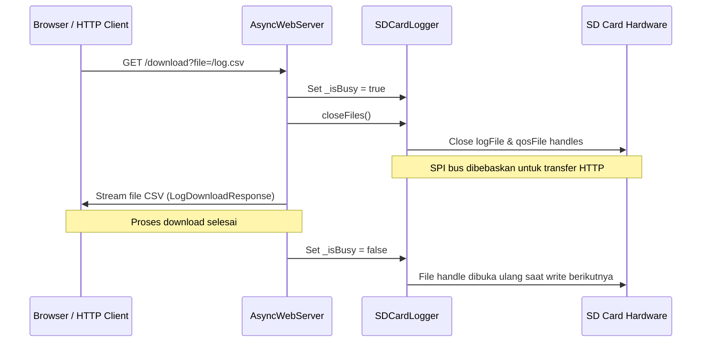

# Penyimpanan Log Kartu SD (SD Card Logging)

Gateway mengimplementasikan perekaman data jangka panjang (*data logging*) pada media penyimpanan eksternal MicroSD menggunakan modul [SDCardLogger](file:///home/dhimasardinata/Dokumen/ta/gateway/src/SDCardLogger.cpp). Modul ini bertugas mencatat metrik lingkungan, status aktuasi relay secara berkala, dan statistik kualitas layanan (QoS) pengiriman data dari Node.

---

## Konfigurasi Hardware SPI

Komunikasi antara ESP32 dengan modul kartu SD berjalan di atas bus **SPI hardware** dengan frekuensi clock operasional dibatasi pada **4 MHz** (`4000000` Hz) untuk menjaga integritas sinyal pada kabel jumper. Pinout yang digunakan adalah:

* **`SD_CS` (Chip Select)**: GPIO 2
* **`SD_SCK` (Serial Clock)**: GPIO 18
* **`SD_MISO` (Master In Slave Out)**: GPIO 19
* **`SD_MOSI` (Master Out Slave In)**: GPIO 13

Bus SPI ini diinisialisasi melalui `SPI.begin(SD_SCK, SD_MISO, SD_MOSI, SD_CS)` sebelum modul `SD.begin` dipanggil.

---

## Skema dan Format CSV File

Dua berkas log bertipe *comma-separated values* (CSV) disimpan secara permanen di akar direktori kartu SD:

### 1. Log Lingkungan dan Aktuasi (`/log.csv`)
Mencatat parameter sensor rata-rata greenhouse, status fisik relay, ambang batas, dan dasar pengambilan keputusan kontrol.
* **Format Header**:
  ```csv
  DateTime,Temperature,Humidity,Light,NetworkType,Signal,Relay1,Relay2,Relay3,Relay4,FogStatus,Tmin,Tmax,Hmin,Hmax,GatewayMode,ThresholdSource,ScheduleSource,R1ScheduleActive,R2ScheduleActive,R3ScheduleActive,R1ScheduleId,R2ScheduleId,R3ScheduleId,R1Decision,R2Decision,R3Decision
  ```
* **Contoh Record**:
  ```csv
  2026-05-22 14:40:00,28.50,75.0,320.0,WiFi,-65,ON,OFF,ON,OFF,0,20.0,35.0,50.0,80.0,AUTO,CLOUD,CLOUD,0,0,1,0,0,5,THRESHOLD,THRESHOLD,SCHEDULE
  ```

### 2. Log Kualitas Layanan Node (`/qos.csv`)
Mencatat setiap transaksi paket data sensor yang diterima dari Node (termasuk paket *cross-talk* dari greenhouse lain) untuk audit kualitas link radio RF.
* **Format Header**:
  ```csv
  RX_Time,Node_ID,TX_Time,Size_Bytes,RSSI_Act,RSSI_NonAct
  ```
* **Contoh Record**:
  ```csv
  2026-05-22 14:40:05,node-1,2026-05-22 14:39:58,156,-62,-92
  ```

---

## Kebijakan Pembuangan Cache (Flush Policy)

Menulis ke kartu SD membutuhkan daya listrik yang tinggi dan dapat memblokir eksekusi program. Oleh karena itu, modul ini menggunakan dua strategi pembuangan data (*flush*) yang berbeda:

* **Log Data Utama (`/log.csv`) - Deferred Flush**:
  * Ditulis secara berurutan di RAM buffer.
  * Fungsi `logData(...)` memicu pengurasan tangki buffer ke memori fisik flash kartu SD setiap **12 kali penulisan** (`FLUSH_INTERVAL = 12`).
  * Strategi penangguhan (*deferred flush*) ini memperpanjang masa pakai kartu SD dengan meminimalkan siklus penulisan fisik sektor flash (*write wear-leveling*).
* **Log QoS (`/qos.csv`) - Immediate Flush**:
  * Perekaman QoS harus bersifat real-time agar tidak kehilangan data koneksi jika terjadi mati listrik mendadak.
  * File QoS langsung di-flush setiap kali ada paket data masuk (`qosFile.flush()`).

---

## Mekanisme Kunci Akses Unduhan (`_isBusy`)

Untuk mencegah tabrakan akses berkas ketika administrator mengunduh log melalui REST API (`GET /download`), modul ini menggunakan sistem sinkronisasi berbasis flag kesibukan `_isBusy`:



1. **Ketika proses unduh dimulai**:
   * Server web menetapkan `_isBusy = true`.
   * Memanggil `closeFiles()` untuk melepaskan seluruh *file handle* terbuka pada kartu SD.
   * Memberikan jeda waktu (100–200 ms) agar sistem operasi menutup *descriptor* file secara sempurna.
2. **Saat pengunggahan/pengunduhan berlangsung**:
   * Jika fungsi `logData()` atau `logQoS()` dipanggil dari loop utama, fungsi tersebut akan langsung **dilewati (bypass) tanpa menulis apa pun**.
   * Ini menghindari tabrakan bus SPI, *file locking*, atau kerusakan berkas FAT32 pada kartu SD.
3. **Setelah unduhan selesai atau gagal**:
   * Response unduhan menurunkan `_isBusy` kembali ke `false` ketika stream selesai.
   * Jika file handle masih tertutup, write berikutnya akan membuka ulang file log dalam mode append. Jalur error tertentu juga dapat memanggil `reInit()` untuk me-mount ulang kartu SD.

Lanjutkan ke bagian **[LCD Display](./lcd-display.md)** untuk melihat antarmuka visual status Gateway.
