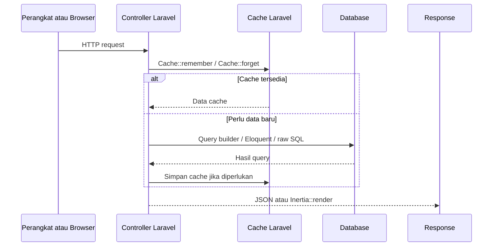

# Cara Kerja Laravel

Controller Laravel di snapshot ini mengolah dua jenis output: response JSON untuk perangkat/dashboard, dan halaman Inertia untuk tampilan web.

## Siklus Request



## Cache yang Dipakai

`ScheduleController::getSchedule()` menyimpan response jadwal gateway selama 60 detik dengan key berbasis `md5(json_encode(...))`.

`PageController` memakai cache pendek untuk data monitoring, heatmap, status aktuator, jadwal controlling, dan waktu data terbaru.

`ApiController::saveSensorData()` membersihkan cache monitoring dan heatmap setelah ada data sensor baru. `updateThresholds()` membersihkan cache threshold heatmap dan data controlling.

## Snapshot Sensor

Controller memakai `sensor_snapshots` sebagai tabel nilai terakhir. Saat data baru masuk:

1. `sensor_data` menerima baris historis baru.
2. `sensor_snapshots` diperbarui dengan `updateOrInsert()`.
3. Cache dashboard yang bergantung pada snapshot dibuang.

Saat halaman monitoring/heatmap dibuka, `PageController::ensureSensorSnapshotsReady()` dapat mengisi ulang snapshot dari `sensor_data` memakai SQL:

```sql
INSERT INTO sensor_snapshots (...)
SELECT ...
FROM sensor_data sd
INNER JOIN (
    SELECT sensor_id, node_id, MAX(id) AS latest_id
    FROM sensor_data
    GROUP BY sensor_id, node_id
) latest ON latest.latest_id = sd.id
ON DUPLICATE KEY UPDATE ...
```

## Render Inertia

`PageController` memanggil `Inertia::render()` untuk halaman:

- `Monitoring`
- `Table`
- `Heatmap`
- `Camera`
- `Controlling`

Beberapa props dikirim sebagai closure agar data berat hanya dihitung saat dibutuhkan oleh Inertia.

Lanjutkan ke [Routing](./routing.md).
