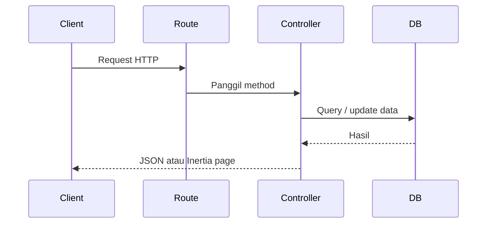

# Cara Kerja Laravel

Laravel bekerja sebagai backend HTTP. Client mengirim request, Laravel menjalankan controller, membaca atau menulis database, lalu mengirim response.

## Alur Konsep

## Bukti dari Snapshot

Controller yang terlihat memakai:

- `Illuminate\Http\Request`
- `Illuminate\Support\Facades\DB`
- `Illuminate\Support\Facades\Cache`
- `Illuminate\Support\Facades\Validator`
- model seperti `Greenhouse`, `Schedule`, `Sensor`, `SensorData`, `DeviceStatus`, `FirmwareFile`
- `Inertia\Inertia`

## Catatan

Lifecycle lengkap Laravel seperti service provider, route middleware, dan auth guard belum terlihat dari file snapshot ini.

Lanjutkan ke [Routing](./routing.md).
