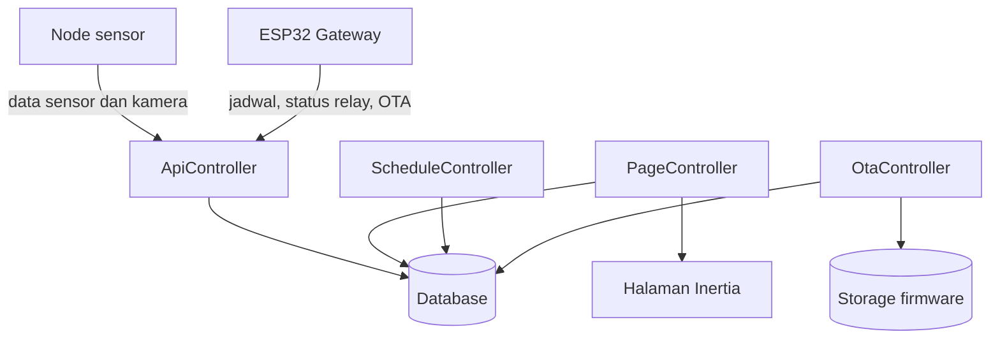

# Overview Backend Laravel

Backend Laravel adalah pusat pertukaran data antara perangkat, database, dan dashboard. Snapshot source yang tersedia memperlihatkan empat controller utama di folder `web/`: `ApiController.php`, `ScheduleController.php`, `OtaController.php`, dan `PageController.php`.

## Tanggung Jawab Controller

| Controller | Fungsi Utama |
|---|---|
| [ApiController.php](file:///home/dhimasardinata/Dokumen/ta/web/ApiController.php) | Menerima data sensor, data kamera, threshold, status device, tabel historis, dan chart. |
| [ScheduleController.php](file:///home/dhimasardinata/Dokumen/ta/web/ScheduleController.php) | Membaca jadwal untuk gateway, membaca jadwal untuk web, dan menyimpan jadwal dari dashboard. |
| [OtaController.php](file:///home/dhimasardinata/Dokumen/ta/web/OtaController.php) | Upload file firmware `.bin` dan menyediakan metadata firmware aktif per node. |
| [PageController.php](file:///home/dhimasardinata/Dokumen/ta/web/PageController.php) | Menyiapkan halaman Inertia untuk monitoring, table, heatmap, camera, dan controlling. |

## Alur Data Utama

Data sensor masuk ke `saveSensorData()`, disimpan ke `sensor_data`, lalu nilai terakhirnya diperbarui ke `sensor_snapshots`. Dashboard monitoring dan heatmap membaca snapshot agar tidak selalu memindai tabel historis.

Jadwal aktuator disimpan lewat `saveSchedules()`. Gateway membaca jadwal lewat `getSchedule()` dalam format ringkas berisi `aktif`, `mulai`, `selesai`, dan `relay`.

Firmware OTA diunggah lewat `uploadFirmware()`. Perangkat membaca metadata terbaru lewat `getFirmwareInfo()`, yang mencari firmware aktif berdasarkan `node_id`.

Lanjutkan ke [Cara Kerja Laravel](./cara-kerja-laravel.md).
