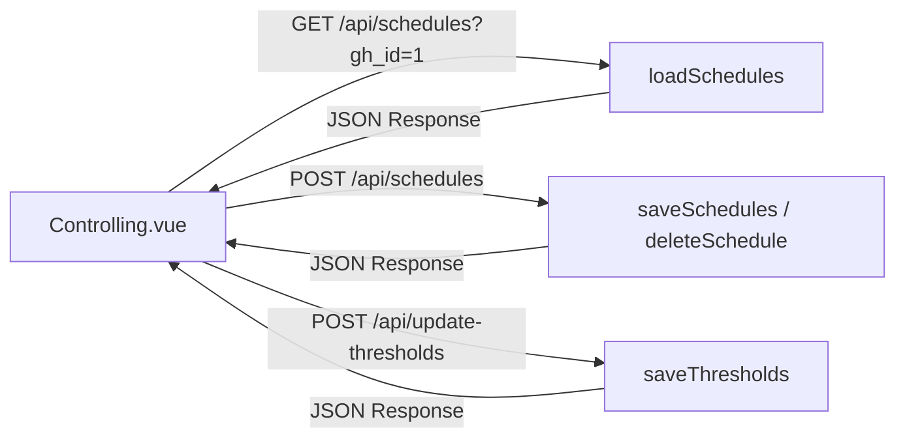

# API Integration Frontend

Frontend Vue.js berkomunikasi dengan backend Laravel melalui dua metode utama: **Hidrasi Data Sinkron (Inertia Props)** untuk pemuatan halaman pertama kali, dan **Request Asinkron (Axios)** untuk interaksi formulir tanpa reload.

---

## 1. Aliran Data Awal (Inertia Props Hydration)

Inertia.js me-render halaman dengan menyuntikkan data server langsung sebagai properti (*Props*) ke komponen Vue. Di dalam komponen `<script setup>`, data ini dibaca secara reaktif menggunakan fungsi computed:

```javascript
import { usePage } from "@inertiajs/vue3";

const page = usePage();
const greenhouses = page.props.greenhouses || [];
const initialData = computed(() => page.props.initialData || []);
const initialSchedules = computed(() => page.props.initialSchedules || {});
```

### Properti Terhidrasi Utama:
*   `greenhouses`: Array nama dan ID rumah kaca anggrek untuk me-render tab menu.
*   `initialData`: Kueri daftar sensor beserta nilai batas default per greenhouse.
*   `initialSchedules`: Objek pemetaan daftar jadwal operasional relay terdaftar.

---

## 2. Permintaan Data Asinkron (Axios HTTP Client)

Untuk interaksi yang tidak memicu perpindahan rute halaman, Vue mengandalkan pustaka **Axios** untuk melakukan panggilan REST API di latar belakang:



### Rincian Integrasi Panggilan API:

#### A. Refresh Daftar Jadwal (`loadSchedules`)
Dipanggil ketika tab greenhouse aktif digeser guna memuat ulang daftar jadwal terbaru:
*   **Method**: `GET`
*   **Endpoint**: `/api/schedules?gh_id={ghId}`
*   **Callback**: Hasil kembalian dipetakan lewat `normalizeSchedule()` untuk menyeragamkan format input jam sebelum dimasukkan ke ref state `schedules`.

#### B. Simpan Perubahan Jadwal (`saveSchedules` & `deleteSchedule`)
Mengirimkan array daftar jadwal aktif ke database Central Hub:
*   **Method**: `POST`
*   **Endpoint**: `/api/schedules`
*   **Payload**: `{ gh_id: activeTab.value, schedules: schedules.value[activeTab.value] }`

#### C. Simpan Batas Sensor (`saveThresholds`)
Mengirimkan daftar ambang batas sensor yang telah diubah pengguna melalui slider:
*   **Method**: `POST`
*   **Endpoint**: `/api/update-thresholds`
*   **Payload**: Objek `thresholds` berisi array `{ sensor_id, threshold_min, threshold_max }`.

---

## 3. Validasi Keamanan dan Kontrak Data Respons

Setiap respons Axios wajib melewati pemeriksaan integritas properti (`success` flag) sebelum mutasi state lokal dilakukan untuk menghindari kerusakan visual dasbor akibat error internal server (seperti database mati):

```javascript
axios.post("/api/schedules", payload)
    .then((response) => {
        if (response.data?.success) {
            // Sukses: perbarui state orisinal & pemicu toast
            toast.success("Perubahan jadwal disimpan");
        } else {
            // Gagal logis di tingkat server (misal validasi gagal)
            toast.error("Gagal menyimpan jadwal");
        }
    })
    .catch((error) => {
        // Gagal fatal di tingkat jaringan (misal timeout HTTP 500)
        toast.error("Kesalahan jaringan: " + error.message);
    });
```

Lanjutkan ke bagian **[Debugging Frontend](./debugging-frontend.md)** untuk melihat panduan penanganan masalah UI dan koneksi.
