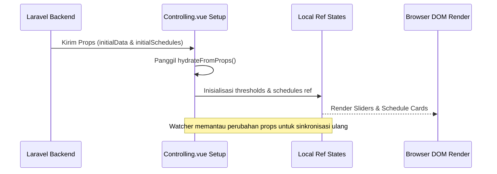

# Cara Kerja Vue

Dashboard Vue.js bekerja dengan memanipulasi state lokal secara reaktif berdasarkan masukan pengguna dan kiriman data dari server. Bagian ini menjelaskan detail siklus hidrasi data, refresh latar belakang otomatis, dan pengiriman form asinkron.

---

## 1. Hidrasi Data Awal (Hydration Cycle)

Saat browser memuat halaman dashboard (misalnya halaman Controlling), server Laravel mengirimkan props awal (`initialData` dan `initialSchedules`).



### Implementasi `hydrateFromProps()`:
Logika di dalam [Controlling.vue](file:///home/dhimasardinata/Dokumen/ta/web/Controlling.vue) bertugas membaca data props terstruktur, menyalin batas threshold per ID sensor ke array lokal, memformat string waktu jadwal, dan menampungnya di dalam state `originalSchedules` sebagai tolok ukur perbandingan modifikasi:
```javascript
const hydrateFromProps = () => {
    data.value = Array.isArray(initialData.value) ? initialData.value : [];
    threshold.value = {};
    // ... loop data sensor untuk set value slider ...
    const nextSchedules = {};
    greenhouses.forEach((gh) => {
        const ghSchedules = initialSchedules.value?.[gh.id] || [];
        nextSchedules[gh.id] = ghSchedules.map((s) => normalizeSchedule(s, gh.id));
    });
    schedules.value = nextSchedules;
    originalSchedules.value = JSON.parse(JSON.stringify(nextSchedules));
};
```

---

## 2. Pembaruan Latar Belakang Otomatis (Auto-Refresh)

Halaman pemantauan seperti Heatmap memerlukan pembaruan berkala tanpa menginterupsi interaksi pengguna (seperti zoom map atau popup marker yang terbuka).

*   **Pola Polling**: Di dalam [Heatmap.vue](file:///home/dhimasardinata/Dokumen/ta/web/Heatmap.vue), fungsi `startAutoRefresh()` memicu kueri asinkron setiap 30 detik (`AUTO_REFRESH_SECONDS = 30`).
*   **Partial Reloads**: Menggunakan Inertia Router dengan opsi `only` untuk membatasi server agar hanya mengirimkan data sensor dan waktu pembaruan terbaru, membiarkan state Leaflet map dan input parameter tetap utuh (`preserveState` dan `preserveScroll` = true):
    ```javascript
    autoRefreshInterval = setInterval(() => {
      router.get(route("heatmap"), {}, {
        preserveState: true,
        preserveScroll: true,
        only: ['sensorDataByGh', 'thresholdsByGh', 'latestData']
      });
    }, 30000);
    ```

---

## 3. Penjaga Navigasi Perubahan Belum Tersimpan (Navigation Guard)

Untuk menghindari kehilangan data konfigurasi akibat pengguna tidak sengaja berpindah tab sebelum menekan tombol simpan, sistem menerapkan pengecekan state reaktif computed:

*   **Deteksi Perubahan**: `isThresholdChanged` mengecek apakah ada kunci tersisa di dalam objek `editedThresholds`. `isScheduleChanged` membandingkan representasi JSON string lokal `schedules` saat ini terhadap `originalSchedules`.
*   **Pemberhentian Tab**: Saat fungsi `confirmTabChange` dipanggil ketika tab greenhouse diklik, ia mengecek kedua penanda reaktif tersebut. Jika salah satu bernilai true, perpindahan dibatalkan dan sistem menembakkan Toast warning:
    ```javascript
    const confirmTabChange = (newTab) => {
        if (isThresholdChanged.value && newTab != activeTab.value) {
            toast.warning(t("controlling.unsaved_threshold_changes"));
            return false; // Batalkan navigasi
        }
        // ...
        activeTab.value = newTab;
    };
    ```

---

## 4. Pengiriman Data Asinkron (Form Submission)

Ketika pengguna menyimpan batas threshold atau schedules:
1.  Tombol simpan menampilkan animasi loading (`isSaving = true`).
2.  Data lokal diformat menjadi payload JSON.
3.  Dikirim melalui Axios POST request ke server Laravel (`/api/update-thresholds` atau `/api/schedules`).
4.  Setelah server merespons sukses, state orisinal (`initialThreshold` atau `originalSchedules`) diperbarui agar sinkron dengan database, memadamkan penanda `isThresholdChanged` kembali ke false, dan memunculkan toast sukses hijau.

Lanjutkan ke bagian **[Monitoring](./monitoring.md)** untuk mempelajari bagaimana data gauge divisualisasikan.
