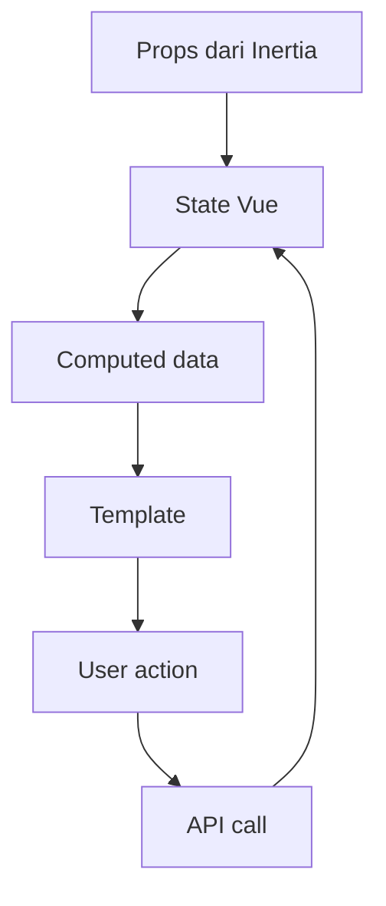

# Cara Kerja Vue

Vue membuat tampilan web dari data reactive. Saat data berubah, tampilan ikut berubah.

## Bukti dari Kode

`Controlling.vue` memakai:

- `ref`
- `watch`
- `computed`
- `usePage`
- `axios`
- `vue-toastification`

`Heatmap.vue` memakai:

- `ref`
- `watch`
- `computed`
- `onMounted`
- `onUnmounted`
- Leaflet
- canvas custom layer.

## Alur Konsep

## Catatan Pemula

`ref` menyimpan data yang bisa berubah. `computed` menghitung nilai turunan. `watch` menjalankan aksi ketika data berubah.

Lanjutkan ke [Login](./login.md).
