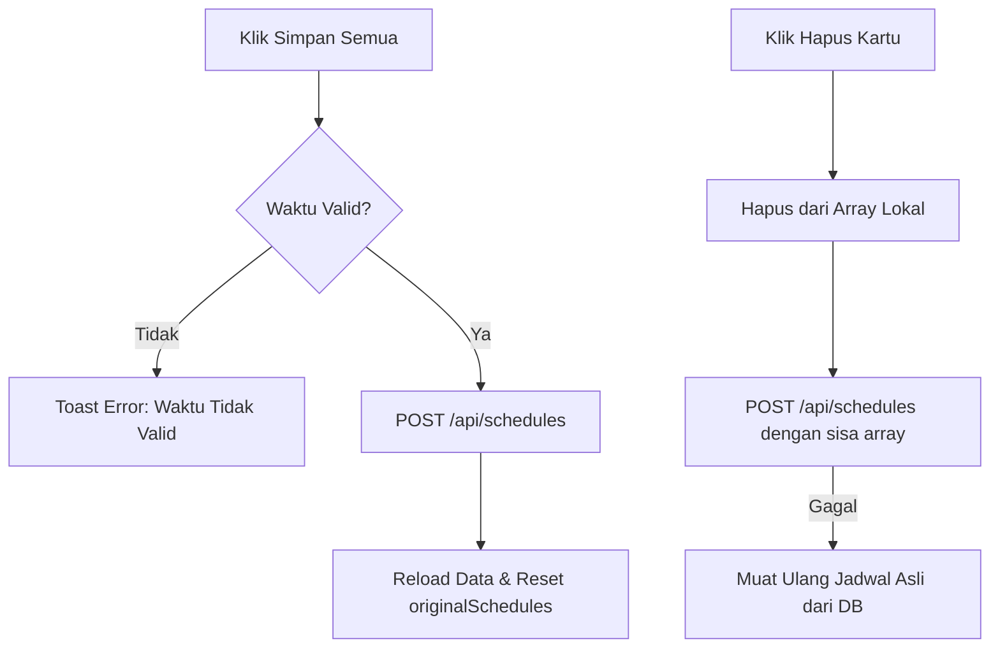

# Controlling Scheduling

Pengelolaan jadwal kerja berkala aktuator dilakukan pada sub-tab **Scheduling** di halaman Controlling (`Controlling.vue`). Antarmuka ini dirancang agar administrator dapat mengatur mode paksa aktif, paksa mati, atau menyerahkan kontrol aktuator secara otomatis ke ambang batas sensor pada jam-jam tertentu.

---

## 1. Komponen Kartu Jadwal (`ScheduleCard.vue`)

Setiap jadwal ditampilkan sebagai satu kartu kontrol modular (**`ScheduleCard`**) yang memiliki kontrol sebagai berikut:
*   **Toggle Aktif (`enabled`)**: Sakelar cepat untuk mengaktifkan atau menonaktifkan jadwal tanpa perlu menghapusnya dari database.
*   **Time Pickers**: Input bertipe waktu (`start_time` dan `end_time`) untuk mendefinisikan jam mulai dan berakhirnya jadwal dengan format `H:i`.
*   **Dropdown Mode Aktuator**: Menu pilihan untuk masing-masing aktuator (Exhaust, Dehumidifier, Blower) dengan tiga pilihan mode:
    1.  **Threshold (Otomatis)**: Menyalakan aktuator hanya jika nilai sensor melampaui ambang batas.
    2.  **Force ON (Selalu Hidup)**: Memaksa aktuator menyala terus selama durasi jadwal, mengabaikan pembacaan sensor.
    3.  **Force OFF (Selalu Mati)**: Memaksa aktuator mati terus selama durasi jadwal, mengabaikan pembacaan sensor.

---

## 2. Validasi Batasan dan Aturan Jadwal

Untuk menjaga kestabilan sistem dan memori parsing mikrokontroler, dasbor menerapkan aturan validasi ketat di sisi klien sebelum data dikirim:

*   **Batas Maksimal 4 Jadwal (`canAddSchedule`)**: ESP32 Gateway membatasi penampungan jadwal di RAM. Dasbor Vue.js memvalidasi jumlah ini secara reaktif. Jika jumlah jadwal sudah mencapai 4, tombol "Tambah Jadwal" otomatis disembunyikan dan diganti dengan label peringatan *Batas Maksimal Jadwal Tercapai (4/4)*.
*   **Validasi Waktu Terbalik (`hasInvalidTimes`)**: Memastikan waktu selesai tidak mendahului atau sama dengan waktu mulai. Jika terdeteksi input tidak logis (misal: Mulai 09:00, Selesai 08:00), tombol simpan dinonaktifkan secara otomatis dan dasbor memicu notifikasi toast kesalahan waktu.
*   **Overlay Jadwal Tumpang Tindih**: Sistem memperbolehkan jadwal tumpang tindih (*overlapping schedules*) jika diinginkan oleh admin (misalnya jadwal pembersihan embun kamera yang mendahului jadwal pendinginan siang hari).

---

## 3. Siklus Penyimpanan dan Penghapusan Asinkron

### Mekanisme Hapus Instan (`deleteSchedule`)
Ketika ikon sampah pada kartu diklik:
1.  Jadwal langsung dihapus dari array lokal `schedules.value`.
2.  Dasbor langsung menembakkan request POST ke `/api/schedules` membawa sisa jadwal yang ada.
3.  Jika penyimpanan gagal di server, sistem otomatis memanggil `loadSchedules(activeTab)` untuk memulihkan kembali tampilan kartu sesuai kondisi terakhir di database untuk mencegah inkonsistensi visual.

Lanjutkan ke bagian **[Login](./login.md)** untuk mempelajari bagaimana akses otentikasi diamankan.
