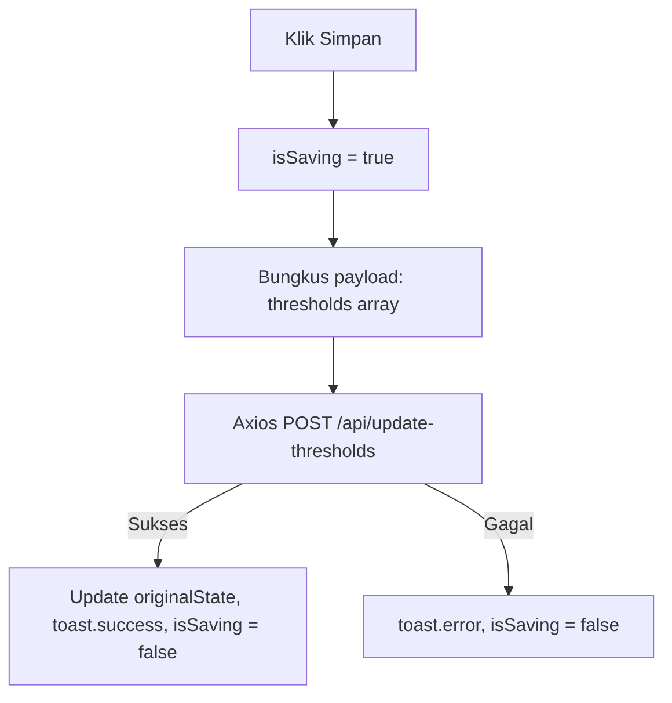

# Controlling Threshold

Pengendalian batas aman lingkungan dilakukan melalui sub-tab Threshold pada halaman Controlling (`Controlling.vue`). Antarmuka ini menyediakan slider ganda (*range slider*) untuk memudahkan pengguna menyetel batas bawah dan batas atas suhu, kelembapan, dan intensitas cahaya secara interaktif.

---

## 1. Integrasi Vueform Slider

Slider batas sensor di-render menggunakan komponen **Vueform Slider** dengan konfigurasi rentang reaktif:
*   **Pengikatan Data**: Slider mengikat data array lokal `threshold[sensor.id]` yang menampung dua elemen angka: indeks `0` (Batas Minimum) dan indeks `1` (Batas Maksimum).
*   **Langkah Presisi desimal (`step = 0.01`)**: Setelan ini memungkinkan pergeseran slider sangat sensitif dan akurat hingga dua digit desimal (`decimals: 2`), yang sangat penting untuk akurasi sensor suhu.
*   **Format Unit**: Slider secara dinamis menampilkan satuan sensor di atas gelembung tooltip petunjuk nilai (seperti `°C` untuk suhu, `%RH` untuk kelembapan, dan `lux` untuk intensitas cahaya).

---

## 2. Penentuan Nilai Batas Maksimal Dinamis (`getMaxValue`)

Rentang gerak slider disesuaikan dengan kapasitas pengukuran fisik sensor di lapangan untuk mencegah masukan yang tidak realistis. Pustaka membaca unit sensor dan menentukan batas menggunakan fungsi `getMaxValue(unit)`:

*   **Intensitas Cahaya (Lux)**: Jika satuan memuat kata `'lux'`, batas maksimal penggeser dibatasi hingga **`60000` lux**.
*   **Suhu dan Kelembapan**: Batas maksimal disetel **`100`** (mencerminkan $100^\circ\text{C}$ atau $100\%\text{RH}$).

---

## 3. Sinkronisasi Dua Arah (Slider & Input Manual)

Untuk kenyamanan pengguna, kolom input angka manual disediakan di bawah slider ganda.
*   Menggeser pegangan slider otomatis memperbarui nilai di kotak input manual.
*   Mengubah angka secara manual di kotak input memicu event `@input="updateThreshold"` yang langsung memperbarui posisi pegangan slider di atasnya.
*   Setiap kali nilai diubah, fungsi `updateThreshold()` membandingkan nilai baru tersebut dengan data orisinal database (`initialThreshold`). Jika berbeda, ID sensor tersebut didaftarkan ke state perubahan `editedThresholds`.

---

## 4. Pengiriman Data Perubahan (Axios POST)

Tombol **Simpan Ambang Batas** hanya muncul secara halus jika terdeteksi perubahan pada state (`isThresholdChanged` = true).



### Format Payload yang Dikirim:
```json
{
  "thresholds": [
    {
      "sensor_id": 4,
      "threshold_min": 25.5,
      "threshold_max": 33.0
    }
  ]
}
```

Lanjutkan ke bagian **[Controlling Scheduling](./controlling-scheduling.md)** untuk mempelajari bagaimana penjadwalan aktuator dikelola.
