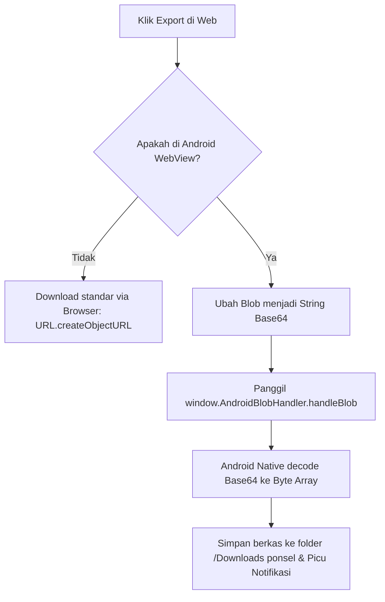

# Export Data Historis

Untuk kebutuhan analisis penelitian anggrek lebih lanjut, dashboard web menyediakan fitur untuk mengekspor (mengunduh) seluruh rekaman tabel data sensor yang tampil di layar menjadi berkas tabel **CSV**.

---

## 1. Pembuatan Berkas Blob di Sisi Klien (Client-Side Blob Generation)

Saat pengguna mengeklik tombol **Export CSV** pada halaman Table:
1.  Vue.js mengumpulkan baris data yang saat ini aktif di state `finalData`.
2.  Data disusun menjadi baris teks string dengan pemisah koma (CSV format).
3.  String tersebut dibungkus menjadi objek **`Blob`** dengan tipe MIME `text/csv;charset=utf-8;`:
    ```javascript
    const blob = new Blob([csvContent], { type: 'text/csv;charset=utf-8;' });
    ```
4.  Pada browser desktop standar, sistem membuat elemen jangkar non-fisik `<a>`, mengaitkan URL representasi blob (`URL.createObjectURL(blob)`), menyetel atribut `download` dengan nama file dinamis (misal: `data_greenhouse_1_export.csv`), memicu event klik secara terprogram, dan langsung membersihkan objek URL memori tersebut.

---

## 2. Jembatan Interaksi dengan Android Native (Android Javascript Interface)

Ketika dashboard web dibuka di dalam aplikasi Android native menggunakan komponen **WebView**, pengunduhan objek blob secara standar akan diblokir oleh sistem keamanan sandbox Android:



### Mekanisme Pengiriman Data via Bridge:
Untuk mengatasi keterbatasan WebView, frontend mendeteksi keberadaan objek antarmuka **`AndroidBlobHandler`** yang diinjeksikan secara native oleh aplikasi Android:
1.  Web mengonversi berkas Blob CSV menjadi string representasi data terenkode **Base64**.
2.  Web memanggil fungsi penghubung:
    ```javascript
    if (window.AndroidBlobHandler) {
        window.AndroidBlobHandler.handleBlob(base64Data, 'text/csv', fileName);
    }
    ```
3.  Aplikasi Android native (diimplementasikan pada kelas `MainActivity` Android) menangkap string tersebut, mendekodekannya kembali menjadi berkas mentah, menulisnya secara fisik ke penyimpanan ponsel `Environment.DIRECTORY_DOWNLOADS`, dan memunculkan notifikasi sistem unduhan selesai.

Lanjutkan ke bagian **[API Integration](./api-integration.md)** untuk mempelajari bagaimanakah data mengalir di balik antarmuka ini.
