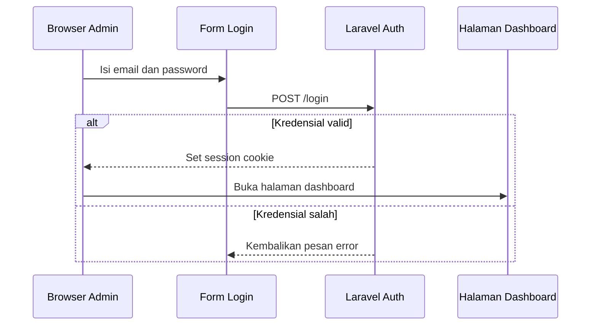

# Login Halaman Dashboard

Snapshot frontend web yang tersedia hanya memuat `Controlling.vue` dan `Heatmap.vue`. File login seperti `Auth/Login.vue` tidak ada di potongan source ini, sehingga halaman ini menjelaskan kebutuhan login dashboard berdasarkan alur Laravel/Inertia yang harus mengitari halaman monitoring dan controlling.

## Kebutuhan Login

Dashboard mengubah threshold, jadwal, dan konfigurasi operasional greenhouse. Karena itu route web seperti `/monitoring`, `/heatmap`, `/table`, `/camera`, dan `/controlling` perlu dilindungi session auth di Laravel penuh.

## Alur yang Diperlukan

## Hubungan dengan File yang Terlihat

`Controlling.vue` memanggil API untuk menyimpan threshold dan jadwal. Jika halaman ini tidak dilindungi auth, pengguna tidak sah dapat mengubah perilaku aktuator. Jadi kontrol akses harus dipasang di route web dan API yang menerima perubahan.

`Heatmap.vue` lebih bersifat monitoring, tetapi tetap menampilkan data operasional greenhouse. Pada deployment nyata, aksesnya sebaiknya mengikuti kebijakan login yang sama.

Lanjutkan ke [Export Data](./export-data.md).
