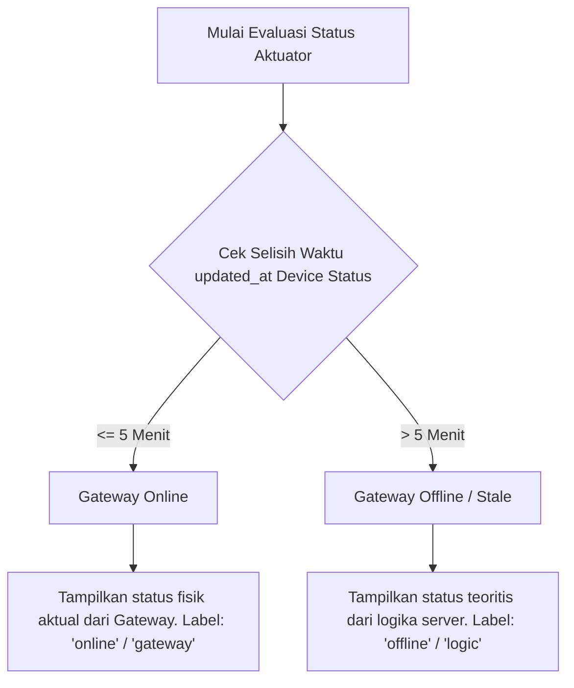

# Monitoring

Halaman Monitoring (`Monitoring.vue`) merupakan layar pemantauan utama yang diakses oleh pengguna untuk memeriksa kondisi lingkungan greenhouse dan memastikan seluruh aktuator fisik berjalan normal.

---

## Komponen Visual Utama Halaman Monitoring

Halaman ini mengintegrasikan tiga jenis visualisasi utama:

1.  **Grup Gauge Sensor**: Menampilkan jarum/diagram lingkaran indikator suhu, kelembapan, dan intensitas cahaya rata-rata hari ini.
2.  **Card Status Aktuator**: Menampilkan kondisi aktuator (Blower, Exhaust, Dehumidifier) apakah sedang menyala (*ON*) atau mati (*OFF*).
3.  **Timestamp Kesegaran Data**: Menampilkan informasi waktu rekaman data terakhir yang berhasil masuk ke server database.

---

## Logika Penentuan Status Koneksi Gateway

Untuk memberikan transparansi operasional, dashboard web tidak hanya menampilkan apakah relay menyala atau mati, tetapi juga menampilkan **dari mana status tersebut berasal** (apakah dibaca langsung dari alat di lapangan, atau sekadar estimasi server):

### Indikator Tampilan Status Aktuator:
*   **Warna Hijau Menyala**: Aktuator saat ini aktif (ON).
*   **Warna Abu-Abu Redup**: Aktuator saat ini tidak aktif (OFF).
*   **Peta Sumber Status (`status_source`)**:
    *   Jika tertulis `gateway` (online): Menunjukkan data valid langsung dari pembacaan pin GPIO ESP32 Gateway.
    *   Jika tertulis `logic` (offline): Memperingatkan pengguna bahwa gateway sedang kehilangan koneksi jaringan, dan status yang ditampilkan di layar hanyalah kalkulasi teoritis server Laravel berdasarkan data sensor terakhir.

---

## Struktur Data Prop Monitoring

Data yang dialirkan oleh `PageController@monitoring` ke halaman `Monitoring.vue` meliputi:

*   **`gaugeData`**: Hasil rata-rata sensor harian teragregasi.
*   **`latestData`**: Waktu perekaman data sensor terakhir per sensor per greenhouse (diformat `"dd/mm/yyyy hh:mm:ss"`).
*   **`actuatorStatus`**: Objek berisi pemetaan status exhaust, dehumidifier, dan blower untuk setiap greenhouse dengan sub-properti:
    *   `status`: Boolean status aktif aktuator.
    *   `mode`: Mode aktif saat ini (`on`, `off`, `threshold`).
    *   `gateway_online`: Boolean status kesehatan gateway.

Lanjutkan ke bagian **[Table](./table.md)** untuk melihat bagaimanakah data mentah historis disajikan.
