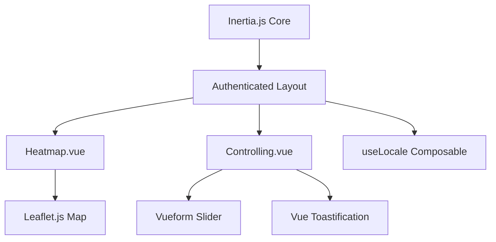

# Overview Frontend Web

Frontend web merupakan dasbor interaktif administratif untuk pemantauan dan pengendalian Greenhouse Anggrek. Dasbor ini dibangun menggunakan **Vue.js 3** dengan sintaks modern **Composition API (`<script setup>`)** dan dijembatani oleh **Inertia.js** untuk menyajikan pengalaman aplikasi satu halaman (*Single Page Application - SPA*) yang mulus.

---

## Arsitektur Frontend Integrasi

Sistem frontend tidak berdiri secara independen di repositori terpisah, melainkan bersatu di dalam struktur Laravel Web. Setiap perpindahan rute dikendalikan oleh router backend Laravel, yang kemudian me-render komponen Vue yang sesuai melalui Inertia.js dengan menyertakan kumpulan data (*props*) yang dibutuhkan.

---

## Fitur dan Pustaka (Library) Utama

Untuk mendukung visualisasi data spasial dan form kontrol yang premium, frontend mengintegrasikan pustaka-pustaka khusus:

1.  **[Leaflet.js](https://leafletjs.com/) (Peta Spasial)**
    Digunakan di dalam [Heatmap.vue](file:///home/dhimasardinata/Dokumen/ta/web/Heatmap.vue) untuk memuat gambar cetak biru denah rumah kaca anggrek dan menggambar titik koordinat node di atas canvas heatmap dinamis.
2.  **[Vueform Slider](https://github.com/vueform/slider) (Penyetel Batas)**
    Digunakan di dalam [Controlling.vue](file:///home/dhimasardinata/Dokumen/ta/web/Controlling.vue) untuk menampilkan penggeser (*slider*) ganda (min dan max) yang responsif guna menyetel ambang batas sensor.
3.  **Vue Toastification (Notifikasi Popup)**
    Menampilkan umpan balik instan berupa pop-up toast hijau (sukses), biru (info), oranye (peringatan), atau merah (gagal) saat aksi simpan ambang batas atau penghapusan jadwal dilakukan.
4.  **useLocale Composable (Multibahasa)**
    Menangani pelokalan bahasa dasbor (Indonesia/Inggris) secara dinamis menggunakan kunci kamus terjemahan `$t('key')` yang terinjeksi dari backend.
5.  **Axios (HTTP Client Async)**
    Digunakan untuk mengirimkan data perubahan konfigurasi atau permintaan jadwal secara asinkron (*AJAX*) tanpa perlu memicu muat ulang halaman.

---

## File Komponen Dasbor Utama

Berdasarkan struktur fisik folder [web/](file:///home/dhimasardinata/Dokumen/ta/web/), terdapat dua visualizer modular utama:

*   **[Heatmap.vue](file:///home/dhimasardinata/Dokumen/ta/web/Heatmap.vue)**: Peta spasial interpolasi suhu, kelembapan, dan lux per greenhouse.
*   **[Controlling.vue](file:///home/dhimasardinata/Dokumen/ta/web/Controlling.vue)**: Editor terpusat untuk konfigurasi batas operasional sensor dan daftar jadwal aktuator.

Lanjutkan ke bagian **[Cara Kerja Vue](./cara-kerja-vue.md)** untuk melihat siklus hidup siklus data di sisi client.
