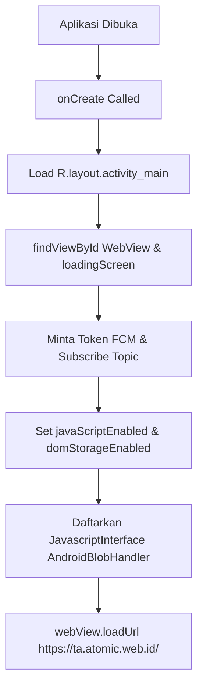

# Aktivitas Utama (MainActivity)

Aktivitas Utama (`MainActivity`) diimplementasikan pada berkas [MainActivity.kt.txt](file:///home/dhimasardinata/Dokumen/ta/android/MainActivity.kt.txt) dan bertindak sebagai pengendali utama siklus hidup aplikasi Android.

---

## Alur Eksekusi Aktivitas (`onCreate`)

Saat aplikasi pertama kali diluncurkan oleh pengguna, sistem memanggil siklus hidup `onCreate()` yang menjalankan instruksi berurutan:



### 1. Inisialisasi Layout dan Penghubung Komponen
Aplikasi memuat layout XML menggunakan `setContentView()` dan menghubungkan instansi komponen visual ke dalam kode Kotlin:
```kotlin
setContentView(R.layout.activity_main)
val webView = findViewById<WebView>(R.id.webView)
val loadingScreen = findViewById<LinearLayout>(R.id.loadingScreen)
```

### 2. Pendaftaran Topik Notifikasi Awan Firebase
Aplikasi meminta token FCM untuk keperluan debugging Logcat dan mendaftarkan perangkat ke topic notifikasi kabut:
```kotlin
FirebaseMessaging.getInstance().subscribeToTopic("peringatan_kabut")
    .addOnCompleteListener { task ->
        if (task.isSuccessful) Log.d("FCM_TOPIC", "Sukses gabung grup peringatan_kabut!")
    }
```
*   **Topik `peringatan_kabut`**: Nama topic ini cocok dengan pemanggilan FCM yang terlihat di `web/ApiController.php` saat status `isFoggy` bernilai benar.

### 3. Pendaftaran Jembatan JavaScript (`addJavascriptInterface`)
Menghubungkan fungsi ekspor Blob agar dapat memanggil fungsi Kotlin secara langsung dari dalam browser WebView:
```kotlin
webView.addJavascriptInterface(object : Any() {
    @android.webkit.JavascriptInterface
    fun getBase64FromBlobData(base64Data: String, mimetype: String, fileName: String) {
        convertBase64ToLogAndDownload(base64Data, mimetype, fileName)
    }
}, "AndroidBlobHandler")
```

---

## Logika Pemrosesan Dekode Berkas (`convertBase64ToLogAndDownload`)

Ketika string Base64 Blob diterima dari jembatan JavaScript:
1.  **Pembersihan Header**: Menggunakan `substring` untuk mencari posisi tanda koma `,` dan memotong prefiks Base64 Data URL (seperti `data:text/csv;base64,`):
    ```kotlin
    val pureBase64 = base64Data.substring(base64Data.indexOf(",") + 1)
    ```
2.  **Decoding Array Byte**: Mengubah string teks murni Base64 menjadi array byte biner menggunakan fungsi utilitas Android:
    ```kotlin
    val fileAsBytes = Base64.decode(pureBase64, Base64.DEFAULT)
    ```
3.  **Tulis ke Downloads**: Membuat instansi file baru di dalam direktori Downloads publik ponsel dan menulis array byte tersebut menggunakan `FileOutputStream`:
    ```kotlin
    val filePath = File(Environment.getExternalStoragePublicDirectory(Environment.DIRECTORY_DOWNLOADS), fileName)
    val os = FileOutputStream(filePath, false) // override mode = false
    os.write(fileAsBytes)
    ```
4.  **Feedback Toast**: Menampilkan visual popup Toast berdurasi panjang (`Toast.LENGTH_LONG`) yang menyatakan file berhasil disimpan di folder Downloads dengan nama file yang sesuai.

Lanjutkan ke bagian **[WebView Loading Screen](./webview-loading.md)** untuk mempelajari transisi pemuatan halaman.
