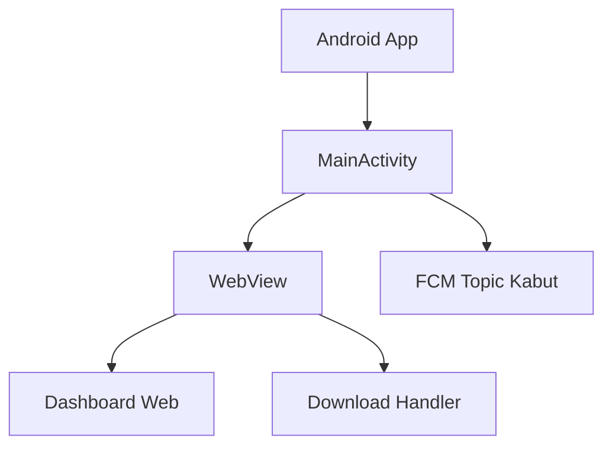

# Cara Kerja Android WebView

WebView adalah komponen Android untuk menampilkan halaman web di dalam aplikasi.

## Alur dari Kode

`MainActivity.kt.txt` melakukan:

1. `setContentView(R.layout.activity_main)`,
2. mengambil `webView` dan `loadingScreen`,
3. mengambil token FCM,
4. subscribe topic kabut,
5. mengaktifkan JavaScript dan DOM storage,
6. menambahkan JavaScript bridge untuk blob download,
7. memasang download listener,
8. memasang WebViewClient,
9. memuat `https://ta.atomic.web.id/`.

## Diagram

Lanjutkan ke [Manifest](./manifest.md).
