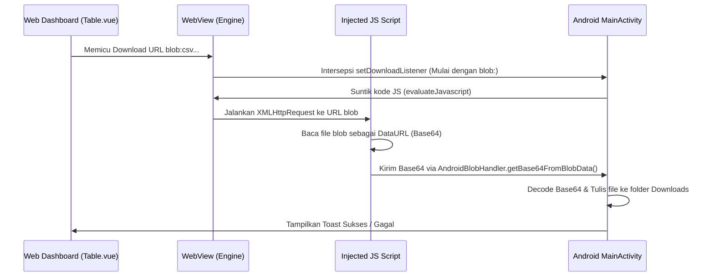

# Cara Kerja Android WebView

WebView bertindak sebagai jendela utama yang me-render dashboard web Central Hub. Bagian ini membedah konfigurasi rekayasa mesin rendering, penanganan pengunduhan file standar, dan algoritma intersepsi unduhan lokal Blob.

---

## 1. Konfigurasi Mesin Rendering WebView

Agar WebView dapat menjalankan dashboard web, beberapa setelan diaktifkan secara eksplisit pada metode `onCreate` di [MainActivity.kt.txt](file:///home/dhimasardinata/Dokumen/ta/android/MainActivity.kt.txt):

*   **`javaScriptEnabled = true`**: Mengizinkan eksekusi kode JavaScript di dalam halaman web.
*   **`domStorageEnabled = true`**: Mengaktifkan storage browser WebView seperti LocalStorage dan SessionStorage.
*   **`fitsSystemWindows = true`**: Memastikan tampilan kontainer WebView otomatis menyesuaikan tinggi area aman layar (*safe area margins*), menempatkan konten web dengan pas di bawah status bar ponsel tanpa terpotong notch kamera.

---

## 2. Manajemen Unduhan File Standar (`DownloadManager`)

Ketika pengguna mengeklik tautan file biasa di web dasbor (misal link PDF panduan atau berkas eksternal), WebView memicu `setDownloadListener`:

1.  Android memparsing informasi dari web: `url`, `userAgent`, `contentDisposition`, `mimetype`, dan `contentLength`.
2.  Aplikasi membuat objek antrean unduhan native menggunakan sistem layanan sistem Android **`DownloadManager`**:
    ```kotlin
    val request = DownloadManager.Request(Uri.parse(url))
    val fileName = URLUtil.guessFileName(url, contentDisposition, mimetype)
    request.setMimeType(mimetype)
    request.setDestinationInExternalPublicDir(Environment.DIRECTORY_DOWNLOADS, fileName)
    request.setNotificationVisibility(DownloadManager.Request.VISIBILITY_VISIBLE_NOTIFY_COMPLETED)
    ```
3.  Nama berkas ditebak secara otomatis menggunakan `URLUtil.guessFileName()`.
4.  Berkas dimasukkan ke antrean unduhan sistem dan disimpan di folder Downloads ponsel (`Environment.DIRECTORY_DOWNLOADS`). Notifikasi unduhan selesai dimunculkan di bar status ponsel.

---

## 3. Algoritma Intersepsi Berkas Blob (Blob Downloader Bridge)

Kode Android memperlakukan URL berawalan **`blob:`** sebagai jalur khusus. Untuk jalur ini, aplikasi menyuntikkan JavaScript dan mengirim isi file virtual kembali ke Kotlin melalui jembatan **`AndroidBlobHandler`**:



### Kode Script Injeksi JavaScript:
Saat mendeteksi URL berawalan `blob:`, Android menyuntikkan kode JavaScript ke halaman aktif untuk membaca isi memori biner tersebut:
```javascript
var xhr = new XMLHttpRequest();
xhr.open('GET', '$url', true);
xhr.responseType = 'blob';
xhr.onload = function() {
    if (this.status == 200) {
        var reader = new FileReader();
        reader.readAsDataURL(this.response); // Ubah biner ke Base64 DataURL
        reader.onloadend = function() {
            // Kirim string Base64 kembali ke Kotlin
            AndroidBlobHandler.getBase64FromBlobData(reader.result, '$mimetype', '$fileName');
        }
    }
};
xhr.send();
```

### Pemrosesan Native Kotlin:
Di sisi Kotlin, fungsi `convertBase64ToLogAndDownload()` memproses umpan balik tersebut:
1.  **Pembersihan Header**: Membuang header Base64 (misal substring sebelum tanda koma `,` dari string `data:text/csv;base64,`).
2.  **Decoding**: Mengonversi sisa string Base64 kembali menjadi byte array menggunakan `Base64.decode(pureBase64, Base64.DEFAULT)`.
3.  **Tulis Berkas**: Menulis byte array tersebut ke disk fisik Downloads ponsel menggunakan `FileOutputStream` dan menampilkan Toast konfirmasi sukses.

Lanjutkan ke bagian **[AndroidManifest](./manifest.md)** untuk melihat konfigurasi permissions dan services.
