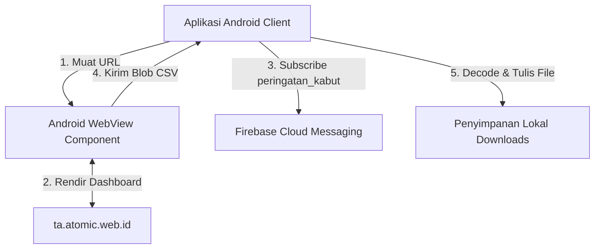

# Overview Android Client

Aplikasi Android dalam proyek Tugas Akhir IoT Greenhouse ini dikembangkan sebagai **Native WebView Wrapper**. Perangkat lunak ini bertindak sebagai klien seluler terdedikasi untuk memuat dasbor web pemantauan, menjembatani operasi pengunduhan file lokal, dan menerima notifikasi peringatan darurat secara real-time.

---

## Arsitektur Klien Seluler

Aplikasi Android yang terlihat pada snapshot ditulis dengan **Kotlin** dan bekerja sebagai wrapper WebView. Versi SDK, konfigurasi Gradle, serta resource lengkap belum terlihat di folder Android snapshot, sehingga halaman ini hanya menjelaskan perilaku yang bisa dibuktikan dari tiga file teks yang tersedia.

---

## Fungsi dan Peran Utama Aplikasi

1.  **Pemuat Dasbor Terdedikasi**: Mengarahkan pengguna langsung ke URL pusat `https://ta.atomic.web.id/` dengan setelan browser teroptimasi tanpa perlu mengetikkan alamat URL secara manual di browser seluler biasa.
2.  **Transisi Splash Screen (Loading)**: Menampilkan antarmuka pemuatan transisi dengan indikator Progress Spinner sebelum halaman web selesai dirender untuk memberikan kenyamanan visual (menghindari efek *white-flash* layar kosong).
3.  **Pengaktif JavaScript & DOM Storage**: Mengizinkan halaman web menjalankan JavaScript dan memakai storage browser WebView.
4.  **Notifikasi Push Peringatan Kabut**: Berlangganan secara otomatis ke topik FCM `peringatan_kabut` pada saat pertama kali aplikasi dibuka untuk menerima peringatan push notifikasi jika kamera greenhouse mendeteksi embun.
5.  **Jembatan Ekspor Blob (File Downloader Bridge)**: Mendeteksi event unduhan berkas CSV di web dasbor, mengonversinya menjadi Base64, dan menyimpannya ke folder Downloads memori fisik perangkat Android.

---

## Daftar Berkas Kode Sumber Utama

Seluruh logika kerja aplikasi Android ini dikemas di dalam tiga berkas fisik utama pada folder [android/](file:///home/dhimasardinata/Dokumen/ta/android/):

*   **[MainActivity.kt.txt](file:///home/dhimasardinata/Dokumen/ta/android/MainActivity.kt.txt)**: Kelas aktivitas utama yang mengatur konfigurasi WebView, mendaftarkan FCM, dan menjembatani penyimpanan data blob ekspor.
*   **[activity_main.xml.txt](file:///home/dhimasardinata/Dokumen/ta/android/activity_main.xml.txt)**: Berkas desain layout XML yang menyusun penempatan ProgressBar loading dan kontainer WebView.
*   **[AndroidManifest.xml.txt](file:///home/dhimasardinata/Dokumen/ta/android/AndroidManifest.xml.txt)**: Dokumen manifest yang mendefinisikan permission jaringan/penyimpanan lama, `MainActivity`, referensi resource, dan deklarasi service Firebase Messaging.

Lanjutkan ke bagian **[Cara Kerja Android WebView](./cara-kerja-android-webview.md)** untuk mempelajari konfigurasi dan siklus hidup webview.
