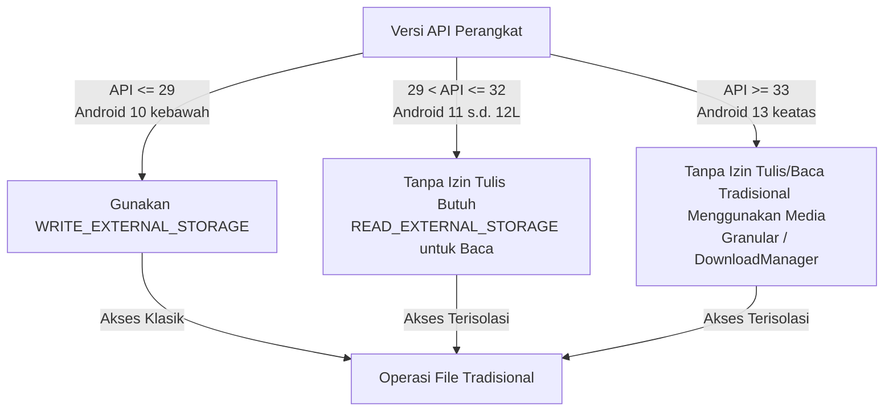

# Izin Aplikasi (Permission)

Aplikasi client Android membutuhkan beberapa izin (*permissions*) dari sistem operasi untuk menjalankan fungsinya secara optimal, terutama dalam mengakses jaringan internet untuk merender dasbor dan menulis berkas hasil ekspor ke penyimpanan fisik ponsel.

Seluruh izin ini dideklarasikan di dalam berkas [AndroidManifest.xml.txt](file:///home/dhimasardinata/Dokumen/ta/android/AndroidManifest.xml.txt).

---

## 1. Daftar Izin yang Dideklarasikan

Berikut adalah tabel rincian izin sistem yang tertera di dalam dokumen manifes aplikasi:

| Nama Izin sistem | Atribut Khusus | Kategori | Alasan & Fungsi |
| :--- | :--- | :--- | :--- |
| **`android.permission.INTERNET`** | *Tidak ada* | Standard / Normal | Dibutuhkan WebView untuk memuat halaman dasbor web Atomic (`https://ta.atomic.web.id/`) dari server cloud. |
| **`android.permission.ACCESS_NETWORK_STATE`** | *Tidak ada* | Standard / Normal | Memungkinkan aplikasi untuk membaca informasi status jaringan (apakah perangkat terhubung ke Wi-Fi atau data seluler). |
| **`android.permission.WRITE_EXTERNAL_STORAGE`** | `android:maxSdkVersion="29"` | Dangerous (Runtime) | Memberikan izin menulis file ke penyimpanan luar pada Android versi lama (Android 10 / API 29 ke bawah). |
| **`android.permission.READ_EXTERNAL_STORAGE`** | `android:maxSdkVersion="32"` | Dangerous (Runtime) | Memberikan izin membaca file dari penyimpanan luar pada Android versi lama (Android 13 / API 32 ke bawah). |

---

## 2. Analisis Regulasi Scoped Storage (maxSdkVersion)

Penggunaan atribut `android:maxSdkVersion` pada izin penyimpanan sangat penting untuk mematuhi regulasi keamanan Android modern terkait **Scoped Storage** (Penyimpanan Terisolasi).



### A. Pembatasan `WRITE_EXTERNAL_STORAGE` (`maxSdkVersion="29"`)
*   **Tujuan**: Sejak Android 10 (API 29), Android memperkenalkan kebijakan Scoped Storage di mana setiap aplikasi memiliki direktori sandbox terisolasi.
*   **Perilaku**: Aplikasi dapat membuat dan menulis berkas ke folder publik seperti `Environment.DIRECTORY_DOWNLOADS` tanpa memerlukan izin `WRITE_EXTERNAL_STORAGE`.
*   **Implementasi Manifes**:
    ```xml
    <uses-permission android:name="android.permission.WRITE_EXTERNAL_STORAGE" android:maxSdkVersion="29" />
    ```
    Atribut `android:maxSdkVersion="29"` menginstruksikan sistem Android agar **hanya meminta izin ini pada perangkat bersistem Android 10 atau yang lebih lama**. Pada Android 11 (API 30) ke atas, sistem akan mengabaikan permintaan izin ini secara otomatis karena operasi penyimpanan publik dialihkan ke mekanisme aman tanpa dialog izin.

### B. Pembatasan `READ_EXTERNAL_STORAGE` (`maxSdkVersion="32"`)
*   **Tujuan**: Mulai Android 13 (API 33), izin membaca penyimpanan eksternal yang bersifat menyeluruh (`READ_EXTERNAL_STORAGE`) telah ditiadakan dan didepresiasi oleh Google. Izin tersebut digantikan oleh izin media granular (`READ_MEDIA_IMAGES`, `READ_MEDIA_VIDEO`, dll.).
*   **Perilaku**: Karena aplikasi kita hanya menyimpan hasil unduhan biner CSV dan memanggil `DownloadManager` sistem, aplikasi tidak memerlukan hak membaca media secara luas di perangkat Android 13+.
*   **Implementasi Manifes**:
    ```xml
    <uses-permission android:name="android.permission.READ_EXTERNAL_STORAGE" android:maxSdkVersion="32" />
    ```
    Izin ini hanya akan aktif dan diminta saat aplikasi berjalan di Android 12L (API 32) ke bawah.

---

## 3. Hubungan Izin dengan Fitur Pengunduhan File

Operasi penyimpanan file di dalam [MainActivity.kt.txt](file:///home/dhimasardinata/Dokumen/ta/android/MainActivity.kt.txt) sangat bergantung pada struktur izin ini:

### A. Jalur Pengunduhan Standar (`DownloadManager`)
Mekanisme pengunduhan standar memanfaatkan layanan bawaan OS:
```kotlin
val request = DownloadManager.Request(Uri.parse(url))
request.setDestinationInExternalPublicDir(Environment.DIRECTORY_DOWNLOADS, fileName)
```
Sistem `DownloadManager` berjalan sebagai layanan Android. Untuk tautan HTTP/HTTPS biasa, jalur ini biasanya lebih aman terhadap perubahan aturan storage karena sistem yang mengelola antrean unduhan. Meski begitu, perilaku persis tetap perlu diuji pada `targetSdk` project Android lengkap.

### B. Jalur Ekspor Blob (Base64 Bridge)
Untuk berkas ekspor CSV virtual, aplikasi melakukan penyimpanan langsung melalui aliran data native:
```kotlin
val filePath = File(Environment.getExternalStoragePublicDirectory(Environment.DIRECTORY_DOWNLOADS), fileName)
val os = FileOutputStream(filePath, false)
os.write(fileAsBytes)
```
*   Pada Android lama, kode seperti ini bergantung pada izin storage yang dideklarasikan di manifest.
*   Pada Android modern, penulisan langsung ke folder publik lewat `FileOutputStream` tidak boleh dianggap pasti lancar. Perlu pengujian di perangkat target; bila gagal, jalur yang lebih sesuai adalah `MediaStore`, Storage Access Framework, atau menyerahkan ekspor ke `DownloadManager`.

Lanjutkan ke bagian **[Error Handling](./error-handling.md)** untuk melihat bagaimana kegagalan koneksi dan penyimpanan ditangani secara native.
