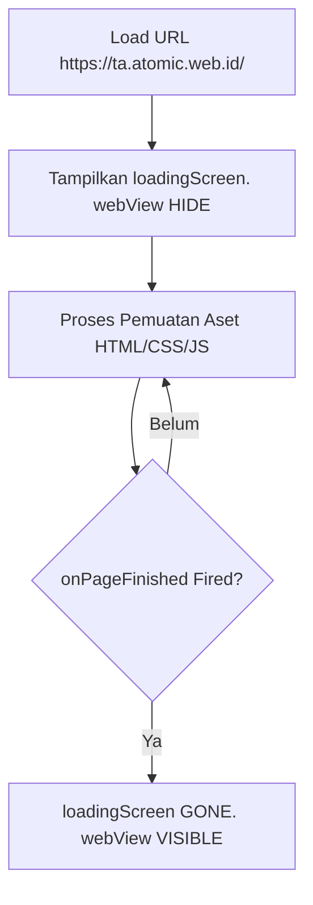

# WebView Loading Screen

Aplikasi Android dilengkapi dengan **Loading Screen Transisional** untuk menjaga kenyamanan pengalaman pengguna (*User Experience*). Sistem ini menyembunyikan browser WebView yang sedang memuat aset dan menampilkan ProgressBar animasi di tengah layar untuk menghindari kedipan layar putih (*white flash*) saat aplikasi dibuka pertama kali.

---

## 1. Komponen Layout XML (`activity_main.xml`)

Di dalam berkas [activity_main.xml.txt](file:///home/dhimasardinata/Dokumen/ta/android/activity_main.xml.txt), area layar dibagi menjadi dua penampung bertumpuk menggunakan kontainer **RelativeLayout**:

1.  **LinearLayout (`loadingScreen`)**:
    Ditempatkan tepat di tengah layar (`android:layout_centerInParent="true"`). Kontainer ini menampung ikon aplikasi (`ImageView`), indikator sirkular berputar (`ProgressBar` spinner default Android), dan teks panduan `TextView` *"Memuat Atomic..."*.
2.  **WebView (`webView`)**:
    Menyusun area layar secara penuh (`match_parent`), namun disembunyikan sejak awal menggunakan status visibilitas awal:
    `android:visibility="gone"`

---

## 2. Transisi Visibilitas pada `onPageFinished`

Logika pemindahan tampilan diatur oleh siklus callback `WebViewClient` pada berkas [MainActivity.kt.txt](file:///home/dhimasardinata/Dokumen/ta/android/MainActivity.kt.txt):



### Kode Transisi Kotlin:
```kotlin
webView.webViewClient = object : WebViewClient() {
    override fun onPageFinished(view: WebView?, url: String?) {
        super.onPageFinished(view, url)
        // 1. Matikan loading screen secara permanen
        loadingScreen.visibility = View.GONE
        // 2. Munculkan WebView dasbor ke hadapan pengguna
        webView.visibility = View.VISIBLE
    }
}
```

### Arti Status Visibilitas Android:
*   **`View.VISIBLE`**: Komponen dirender penuh di layar dan memakan ruang tata letak.
*   **`View.GONE`**: Komponen disembunyikan sepenuhnya dari pandangan, dinonaktifkan dari memori rendering layar, dan ukurannya dibebaskan dari ruang tata letak (sehingga WebView otomatis meluas memenuhi seluruh layar ponsel).

Lanjutkan ke bagian **[Permission](./permission.md)** untuk mempelajari hak akses eksternal memori.
