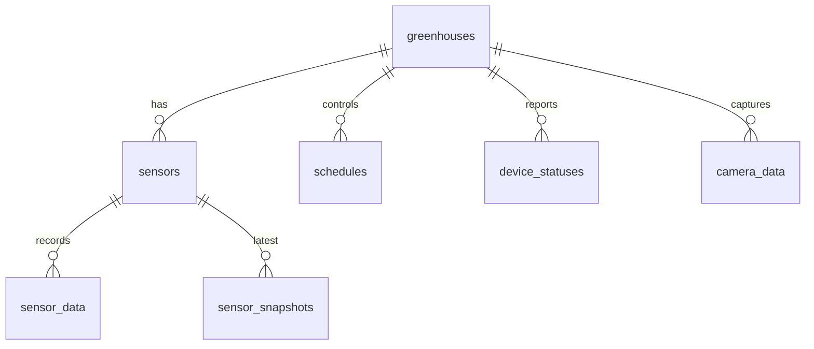

# ERD

ERD adalah diagram hubungan antar tabel.

## ERD Sementara dari Kode

## Batasan

Diagram ini adalah inferensi dari controller, bukan dari migration. Cardinality, foreign key, dan constraint belum terkonfirmasi penuh.

## Sumber Bukti

- `ApiController.php`
- `ScheduleController.php`
- `PageController.php`
- `OtaController.php`

Lanjutkan ke [Tabel Users](./tabel-users.md).
