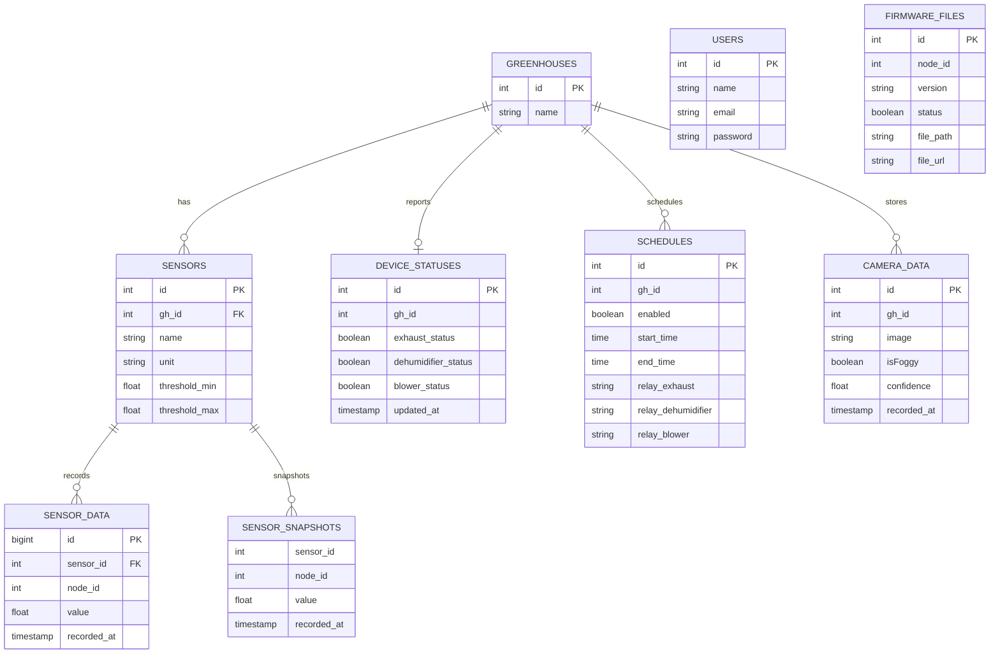

# Entity Relationship Diagram (ERD)

Diagram ini menggambarkan relasi operasional yang dibutuhkan controller. Label `FK` dibaca sebagai kolom penghubung yang dipakai kode, bukan klaim nama constraint migration.

## Relasi Utama

`greenhouses.id` menjadi `gh_id` pada sensor, jadwal, kamera, dan status gateway.

`sensors.id` menjadi `sensor_id` pada histori sensor dan snapshot sensor.

`sensor_snapshots` perlu unik pada pasangan `(sensor_id, node_id)` agar upsert snapshot berjalan benar.

Lanjutkan ke [Tabel Users](./tabel-users.md).
