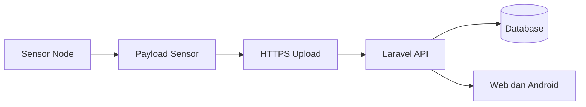

# Uji Node ke Cloud

Uji node ke cloud memastikan node sensor dapat mengirim data ke backend melalui internet.

## Alur yang Diuji

## Bukti dari Kode

- `node/lib/NodeCore/api/ApiClient.*` menangani upload data, target cloud, token, HTTPS, fallback relay, cache, dan RSSI.
- `node/lib/NodeCore/api/ApiClient.Transport*.cpp` menangani transport HTTP/HTTPS.
- `node/lib/NodeCore/api/ApiClient.Upload*.cpp` menangani siklus upload.
- `web/ApiController.php` memiliki `saveSensorData`, `get_average_sensor_data`, `fetchChart`, dan `tablePerGH`.

## Parameter Uji

- Apakah request berhasil masuk ke endpoint backend.
- Apakah data tersimpan di `sensor_data`.
- Apakah snapshot terbaru berubah di `sensor_snapshots`.
- Apakah cache backend dibersihkan setelah data baru masuk.
- Delay dari pembacaan sensor sampai tampil di dashboard.
- Data loss saat Wi-Fi lemah atau backend lambat.
- RSSI selama pengiriman.

## Catatan Keamanan

Source node menunjukkan penggunaan token upload dan HTTPS. Uji harus memastikan token kosong, token salah, dan token benar menghasilkan perilaku yang jelas.

## Status Bukti

Test otomatis untuk payload dan cache sudah terlihat. Test QoS lengkap seperti delay, throughput, dan data loss node ke cloud belum terlihat sebagai file hasil pengujian.

Lanjutkan ke [Uji Node ke Gateway](./uji-node-ke-gateway.md).
