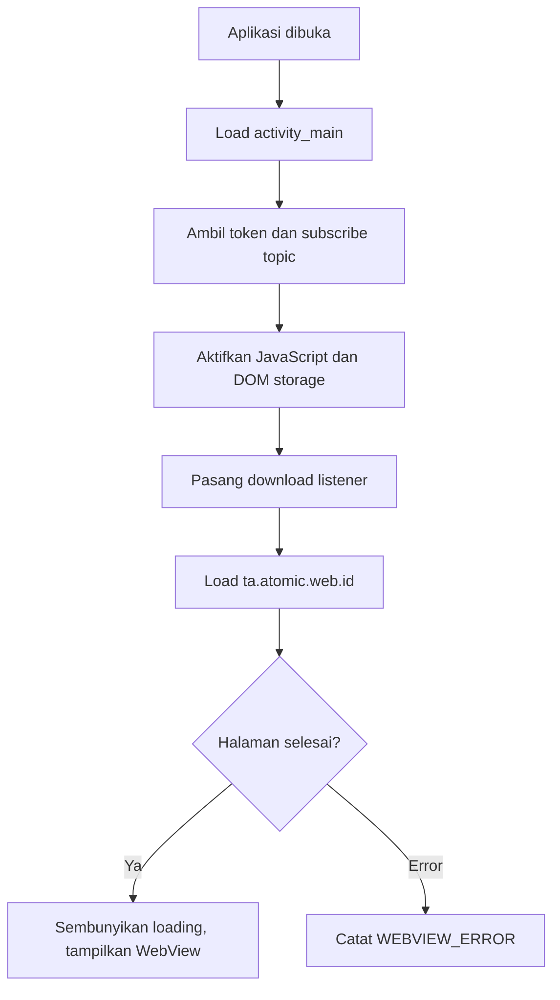

# android/MainActivity.kt.txt

File ini adalah pusat perilaku aplikasi Android. Di sinilah WebView disiapkan, dashboard web dimuat, loading screen disembunyikan, download ditangani, dan FCM dinyalakan.

## Metadata File

| Item | Nilai |
|---|---|
| Source file | `android/MainActivity.kt.txt` |
| Komponen | Android WebView |
| Level | Menengah |
| Status | Drafted |
| Terakhir diperiksa | 2026-05-19 |

## Kenapa File Ini Ada

Sistem TA memakai dashboard web sebagai antarmuka utama. Aplikasi Android pada snapshot ini berfungsi sebagai wrapper WebView yang membuka:

```txt
https://ta.atomic.web.id/
```

Dengan begitu pengguna bisa membuka dashboard greenhouse dari aplikasi Android.

## Kapan File Ini Dipakai

File ini dipakai saat aplikasi Android dibuka. Method `onCreate()` dijalankan pertama kali ketika Activity dibuat.

## Siapa yang Memanggil File Ini

Android OS memanggil `MainActivity` karena manifest menandainya sebagai Activity launcher.

## File Ini Memanggil Apa

File ini memakai:

- `R.layout.activity_main`
- `R.id.webView`
- `R.id.loadingScreen`
- `WebView`
- `WebViewClient`
- `DownloadManager`
- `FirebaseMessaging`
- `AndroidBlobHandler` sebagai jembatan JavaScript ke Kotlin

## Alur Utama



## Data Masuk

- URL dashboard web.
- Token FCM dari Firebase.
- File download dari web.
- Blob export dari JavaScript.
- Error WebView dari Android.

## Data Keluar

- Dashboard web tampil di WebView.
- File biasa masuk ke folder Downloads melalui `DownloadManager`.
- Blob export diubah dari base64 lalu disimpan ke Downloads.
- Log FCM dan WebView masuk ke log Android.

## Error yang Mungkin Terjadi

- Dashboard tidak terbuka jika internet mati atau URL tidak bisa diakses.
- JavaScript error di web bisa memengaruhi WebView karena JavaScript diaktifkan.
- Download blob gagal jika base64 rusak.
- Penyimpanan file bisa gagal karena permission atau kebijakan storage Android versi baru.
- FCM service harus cocok dengan konfigurasi Firebase asli.
- Tombol back belum terlihat ditangani di file ini, jadi perilaku back perlu diuji manual.

## Bagian untuk Pemula

WebView adalah browser kecil di dalam aplikasi. Aplikasi ini tidak membuat ulang dashboard dari nol di Android, tetapi membuka dashboard web yang sudah ada.

## Bagian Advanced

`addJavascriptInterface()` membuat jembatan dari JavaScript ke Kotlin. Ini berguna untuk export blob, tetapi harus hati-hati karena jembatan seperti ini bisa menjadi permukaan keamanan jika halaman yang dimuat tidak dipercaya. Dalam snapshot ini URL yang dimuat adalah domain TA, bukan input bebas dari pengguna.

## Hubungan ke Sistem TA

File ini menghubungkan pengguna Android ke dashboard IoT Greenhouse. Monitoring, heatmap, tabel, kontrol, dan export data tetap berasal dari web, sedangkan Android menyediakan container mobile, download, dan notifikasi.

Kembali ke [Folder Overview Android](./index.md).
