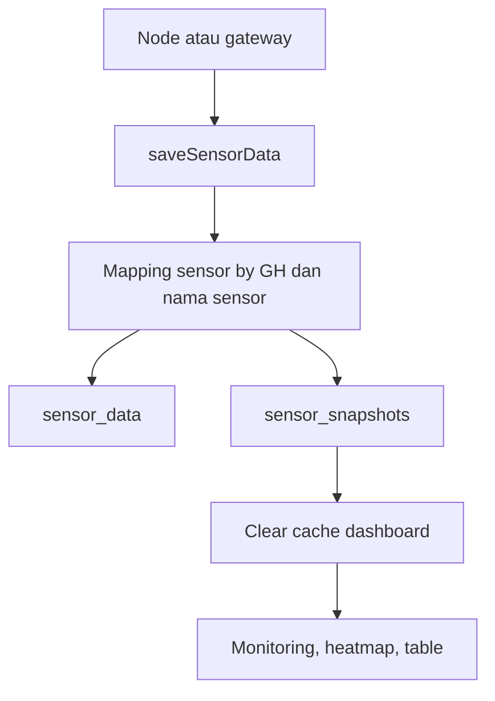

# web/ApiController.php

File ini adalah controller API utama untuk data sensor, data kamera, threshold, device status, dan beberapa endpoint status sederhana.

## Metadata File

| Item | Nilai |
|---|---|
| Source file | `web/ApiController.php` |
| Komponen | Backend Laravel |
| Level | Advanced |
| Status | Drafted |
| Terakhir diperiksa | 2026-05-19 |

## Kenapa File Ini Ada

Backend perlu menerima data dari hardware dan menyediakan data untuk dashboard. File ini menjadi penghubung antara node/gateway, database, cache Laravel, dan frontend.

## Method yang Terlihat

- `tablePerGH()`
- `cameraPerGH()`
- `get_average_sensor_data()`
- `fetchChart()`
- `saveSensorData()`
- `saveCameraData()`
- `updateThresholds()`
- `getDeviceStatus()`
- `postDeviceStatus()`
- `getControlling()`
- `thd()`
- `camera_status()`

## Tabel yang Dipakai

- `sensors`
- `sensor_data`
- `sensor_snapshots`
- `camera_data`
- `device_statuses`
- relasi model `Greenhouse::with('sensor')`

## Alur Data Sensor

## Data Masuk

- `gh_id`
- `node_id`
- `temperature` atau `temp`
- `humidity` atau `hum`
- `light_intensity`, `light`, atau `lux`
- `rssi`
- `recorded_at`
- data kamera base64 pada `saveCameraData()`
- threshold array pada `updateThresholds()`

## Data Keluar

- JSON tabel sensor.
- JSON kamera.
- JSON rata-rata sensor.
- JSON chart.
- JSON status device.
- JSON konfirmasi simpan data.

## Cache yang Terlihat

File ini memakai dan membersihkan cache seperti:

- `sensor_snapshots_initialized`
- `gaugeData`
- `monitoring_latest_time`
- `heatmap_sensor_data`
- `heatmap_latest_time`
- `heatmap_thresholds`
- `controlling_data`
- `count_table_gh_*`

## Error yang Mungkin Terjadi

- Jika sensor `Temperature`, `Humidity`, `Light Intensity`, atau `RSSI` tidak ada, mapping menghasilkan id `0`.
- `saveSensorData()` hanya mewajibkan `gh_id` dan `node_id`; validasi range nilai sensor belum terlihat kuat.
- `saveCameraData()` menerima gambar base64 dan menyimpan file; payload besar atau rusak bisa gagal.
- Query tabel memakai asumsi nama kolom tertentu, sehingga migration yang berbeda bisa membuat endpoint error.
- `fetchChart()` memakai raw date format dan grouping; perubahan database engine perlu diuji.

## Bagian untuk Pemula

Controller adalah petugas penerima permintaan. Kalau node mengirim data sensor, controller ini menerima, memilah, menyimpan, lalu menjawab dalam bentuk JSON.

## Bagian Advanced

File ini banyak memakai query builder dan raw SQL. Itu lebih cepat dan fleksibel, tetapi kontrak database harus jelas. Karena migration tidak terlihat di snapshot ini, tipe data, index, dan foreign key belum bisa dikonfirmasi penuh dari file ini saja.

## Hubungan ke Sistem TA

Tanpa file ini, dashboard tidak punya data sensor terbaru, heatmap tidak punya sumber, tabel tidak bisa mengambil histori, threshold tidak bisa diubah, dan notifikasi kamera berkabut tidak punya endpoint penerima.

Lanjutkan ke [web/ScheduleController.php](./ScheduleController.php.md).
