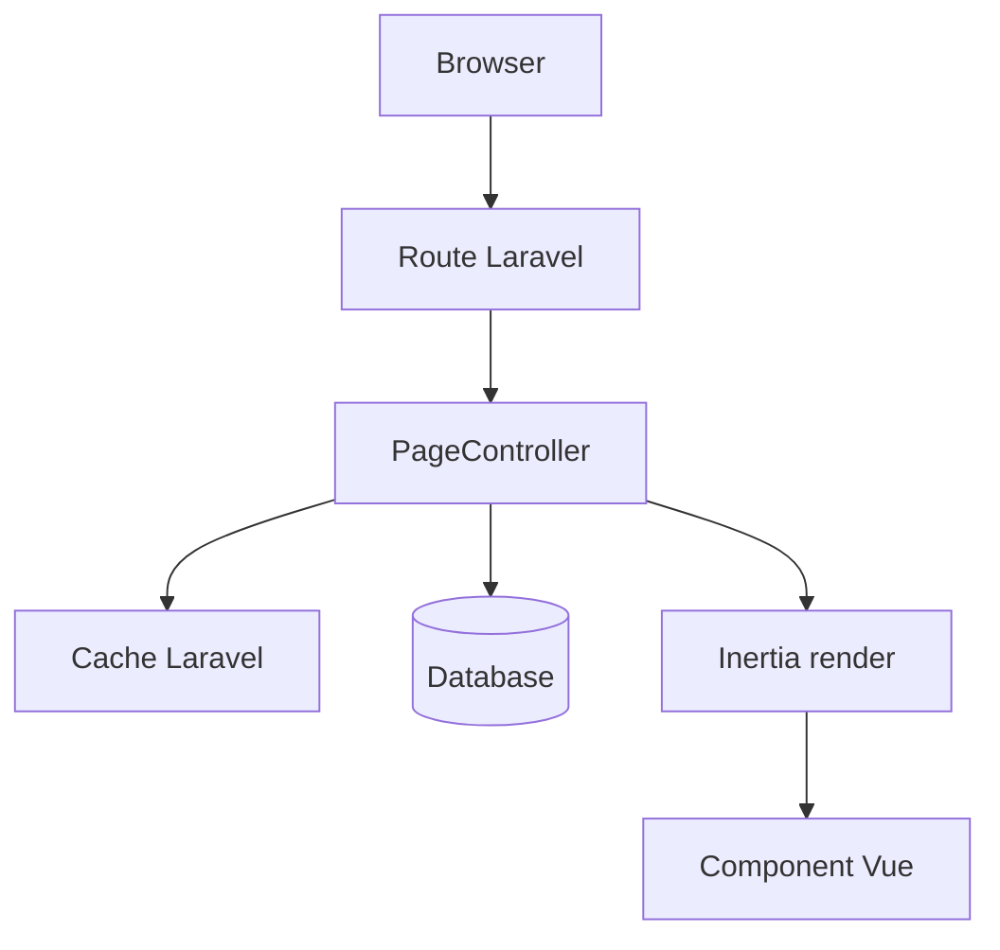

# web/PageController.php

File ini menyiapkan data awal untuk halaman web berbasis Inertia, seperti monitoring, tabel, heatmap, kamera, dan controlling.

## Metadata File

| Item | Nilai |
|---|---|
| Source file | `web/PageController.php` |
| Komponen | Backend Laravel |
| Level | Advanced |
| Status | Drafted |
| Terakhir diperiksa | 2026-05-19 |

## Kenapa File Ini Ada

Frontend Vue membutuhkan data awal saat halaman dibuka. Page controller mengambil data dari database, menyusunnya, memberi cache, lalu mengirimkannya ke component Vue melalui Inertia.

## Method yang Terlihat

Helper internal:

- `getGreenhousesBasic()`
- `ensureSensorSnapshotsReady()`
- `isSensorOutOfThreshold()`
- `resolveActuatorState()`
- `getGatewayStatusFreshnessSeconds()`
- `resolveDisplayedActuatorState()`
- `buildMonitoringActuatorStatus()`

Halaman:

- `monitoring()`
- `table()`
- `heatmap()`
- `camera()`
- `controlling()`

## Tabel dan Model yang Dipakai

- `Greenhouse`
- `Sensor`
- `SensorData`
- `Schedule`
- `DeviceStatus`
- `CameraData`
- `sensor_snapshots`
- `schedules`
- `device_statuses`

## Alur Halaman

## Data yang Dikirim ke Frontend

`monitoring()` mengirim:

- `gaugeData`
- `latestData`
- `actuatorStatus`

`table()` mengirim:

- `greenhouses`

`heatmap()` mengirim:

- `greenhouses`
- `activeGhId`
- `sensorDataByGh`
- `thresholdsByGh`
- `latestData`

`camera()` mengirim:

- `latestData`
- `actuatorStatus`

`controlling()` mengirim:

- `initialData`
- `initialSchedules`

## Cache yang Terlihat

- `greenhouses_basic`
- `sensor_snapshots_initialized`
- `gaugeData`
- `monitoring_latest_time`
- `monitoring_actuator_status`
- `heatmap_sensor_data`
- `heatmap_thresholds`
- `heatmap_latest_time`
- `camera_latest_time`
- `controlling_data`
- `controlling_schedules`

## Error yang Mungkin Terjadi

- Jika `sensor_snapshots` kosong, controller mencoba mengisinya dari `sensor_data`.
- Jika table `device_statuses` tidak ada, controller menghindari query model device status.
- Jika node ID tidak sesuai denah, heatmap bisa mengabaikan data.
- Jika cache belum dibersihkan setelah update, halaman bisa menampilkan data lama.
- Jika migration tidak sesuai asumsi kolom, query raw bisa error.

## Bagian untuk Pemula

File ini tidak langsung menampilkan tombol atau grafik. File ini menyiapkan bahan untuk halaman Vue. Ibarat dapur, PageController menyiapkan bahan sebelum frontend menyajikannya.

## Bagian Advanced

File ini memakai lazy props Inertia dengan closure dan cache pendek. Ini membantu performa, tetapi membuat invalidasi cache penting. Perubahan di endpoint API harus diselaraskan dengan cache key di file ini.

## Hubungan ke Sistem TA

PageController membuat dashboard web bisa membaca kondisi greenhouse, data sensor, aktuator, kamera, heatmap, dan jadwal secara terpadu.

Kembali ke [Folder Overview Backend Laravel](../index.md).
