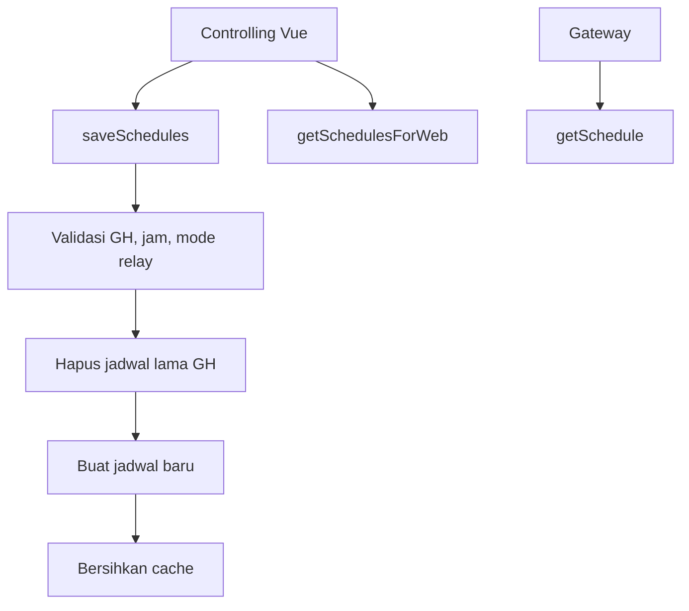

# web/ScheduleController.php

File ini mengatur jadwal aktuator greenhouse, baik untuk gateway maupun halaman web.

## Metadata File

| Item | Nilai |
|---|---|
| Source file | `web/ScheduleController.php` |
| Komponen | Backend Laravel |
| Level | Menengah |
| Status | Drafted |
| Terakhir diperiksa | 2026-05-19 |

## Kenapa File Ini Ada

Gateway dan web membutuhkan format jadwal yang berbeda. Gateway butuh data ringkas untuk polling, sedangkan web butuh data yang nyaman untuk diedit pengguna.

## Method yang Terlihat

- `getSchedule()`
- `saveSchedules()`
- `getSchedulesForWeb()`

## Tabel dan Model yang Dipakai

- `Greenhouse`
- `Schedule`
- cache Laravel

## Alur Jadwal

## Data Masuk

`saveSchedules()` menerima:

- `gh_id`
- `schedules`
- `enabled`
- `start_time`
- `end_time`
- `actuators.blower`
- `actuators.exhaust`
- `actuators.dehumidifier`

Mode aktuator hanya boleh:

- `on`
- `off`
- `threshold`

## Data Keluar

`getSchedule()` mengembalikan format gateway:

- `id`
- `aktif`
- `mulai`
- `selesai`
- `relay`

`getSchedulesForWeb()` mengembalikan format web:

- `id`
- `greenhouse_id`
- `enabled`
- `start_time`
- `end_time`
- `actuators`

## Error yang Mungkin Terjadi

- Jika `gh_id` tidak valid, response bisa 400 atau 404.
- Jika `end_time` tidak setelah `start_time`, simpan jadwal ditolak.
- Jadwal lama dihapus sebelum jadwal baru dibuat. Jika proses gagal di tengah, perlu dikaji apakah data bisa hilang sebagian.
- `getSchedule()` membuat cache key berbasis md5, tetapi `saveSchedules()` menghapus `schedule_gateway_{gh_id}`. Ini perlu review karena ada potensi cache gateway lama tidak ikut terhapus.

## Bagian untuk Pemula

Jadwal menentukan kapan blower, exhaust, dan dehumidifier harus mengikuti mode tertentu. Controller ini seperti admin jadwal: mengambil jadwal, menyimpan jadwal, dan memastikan formatnya benar.

## Bagian Advanced

Validasi `after:schedules.*.start_time` perlu diuji pada array Laravel karena validasi wildcard time bisa punya perilaku yang tidak selalu intuitif. Untuk jadwal melewati tengah malam, file ini saat ini menolak `end_time` yang lebih kecil dari `start_time`, sementara beberapa logic gateway/page mendukung jadwal lintas hari.

## Hubungan ke Sistem TA

File ini menghubungkan kontrol jadwal dari dashboard web ke gateway. Jika file ini salah, aktuator bisa bekerja pada jam yang tidak sesuai.

Lanjutkan ke [web/OtaController.php](./OtaController.php.md).
