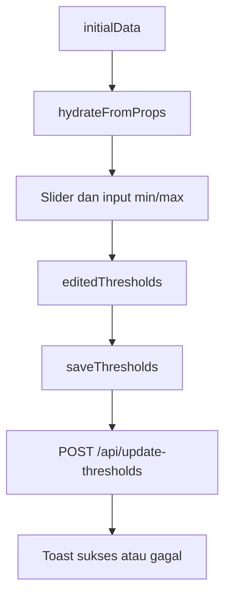
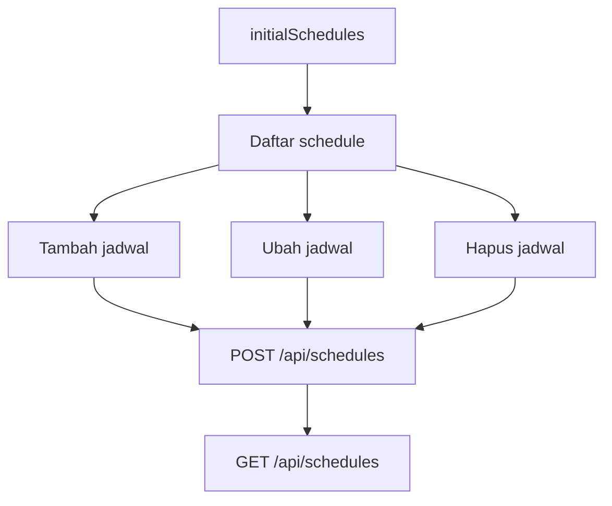

# web/Controlling.vue

File ini adalah halaman frontend untuk mengubah threshold sensor dan jadwal aktuator greenhouse.

## Metadata File

| Item | Nilai |
|---|---|
| Source file | `web/Controlling.vue` |
| Komponen | Frontend Web |
| Level | Menengah |
| Status | Drafted |
| Terakhir diperiksa | 2026-05-19 |

## Kenapa File Ini Ada

Pengguna perlu mengatur batas aman sensor dan jadwal kerja aktuator dari dashboard web. File ini menyediakan tampilan dan interaksi untuk dua hal tersebut.

## Data yang Diterima

File ini membaca data dari Inertia props:

- `greenhouses`
- `initialData`
- `initialSchedules`

Data tersebut disiapkan oleh `web/PageController.php` pada method `controlling()`.

## State Penting

- `activeTab` untuk greenhouse aktif.
- `activeSubTab` untuk memilih threshold atau scheduling.
- `threshold` untuk nilai min dan max sensor.
- `editedThresholds` untuk perubahan threshold yang belum disimpan.
- `schedules` untuk daftar jadwal aktif di setiap greenhouse.
- `originalSchedules` untuk pembanding perubahan jadwal.
- `isSaving` dan `isSavingSchedules` untuk status tombol simpan.

## API yang Dipanggil

- `GET /api/schedules?gh_id=...`
- `POST /api/schedules`
- `POST /api/update-thresholds`

## Alur Threshold

## Alur Jadwal

## Error yang Mungkin Terjadi

- Jika props kosong, halaman tidak langsung hydrate.
- Jika user pindah greenhouse saat ada perubahan, file ini memberi toast warning.
- Jadwal dianggap invalid jika `start_time >= end_time`.
- Overlap jadwal saat ini tidak divalidasi karena `hasOverlappingSchedules` selalu `false`.
- Hapus jadwal langsung menyimpan ke backend; jika request gagal, halaman mencoba reload jadwal.
- Response API yang berubah bisa membuat `response.data?.success` tidak sesuai harapan.

## Bagian untuk Pemula

File ini adalah halaman kontrol. Pengguna memilih greenhouse, memilih sensor atau jadwal, mengubah nilai, lalu menekan simpan. Vue menyimpan perubahan sementara sebelum dikirim ke backend.

## Bagian Advanced

File ini memisahkan threshold dan scheduling di satu component. Untuk maintenance besar, area state schedule dan state threshold bisa menjadi kandidat composable terpisah, tetapi dokumentasi ini hanya mencatat kondisi source saat ini.

## Hubungan ke Sistem TA

Perubahan threshold dan jadwal dari file ini akan memengaruhi keputusan gateway dan tampilan monitoring. Karena itu validasi frontend dan backend harus tetap sinkron.

Lanjutkan ke [web/Heatmap.vue](./Heatmap.vue.md).
