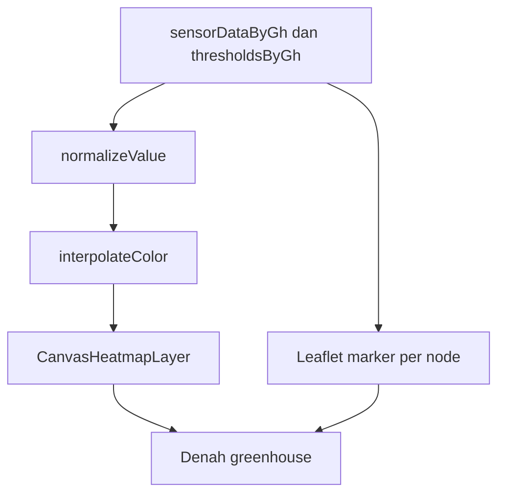

# web/Heatmap.vue

File ini adalah halaman heatmap greenhouse. Halaman ini menampilkan peta greenhouse, posisi node, warna kondisi sensor, dan refresh data berkala.

## Metadata File

| Item | Nilai |
|---|---|
| Source file | `web/Heatmap.vue` |
| Komponen | Frontend Web |
| Level | Advanced |
| Status | Drafted |
| Terakhir diperiksa | 2026-05-19 |

## Kenapa File Ini Ada

Heatmap membantu pengguna melihat sebaran suhu, kelembapan, atau cahaya di greenhouse. Daripada hanya melihat angka tabel, pengguna bisa melihat warna pada denah.

## Data yang Diterima

Props yang terlihat:

- `sensorDataByGh`
- `thresholdsByGh`
- `greenhouses`
- `activeGhId`
- `latestData`

Data ini disiapkan oleh `web/PageController.php` pada method `heatmap()`.

## Library yang Dipakai

- Vue Composition API.
- Inertia router.
- Leaflet.
- Layout `BreezeAuthenticatedLayout`.
- Component `Tabs`.
- Component `DigitalClock`.
- Locale helper `useLocale`.

## Konfigurasi Greenhouse

File ini memiliki konfigurasi denah:

- GH 1 memakai `/images/greenhouse_plan.webp`.
- GH 2 memakai `/images/greenhouse_plan2.webp`.
- GH 1 memetakan node 1 sampai 5.
- GH 2 memetakan node 6 sampai 10.

## Parameter Sensor

Parameter yang bisa dipilih:

- `temperature`
- `humidity`
- `lux`

Masing-masing parameter memakai threshold dari backend untuk menentukan skala warna.

## Alur Heatmap

## Perilaku Refresh

`startAutoRefresh()` memanggil route `heatmap` setiap 30 detik melalui Inertia router. Data yang diminta ulang:

- `sensorDataByGh`
- `thresholdsByGh`
- `latestData`

## Error yang Mungkin Terjadi

- Jika node ID tidak ada di `nodeLocations`, data node tidak ditampilkan.
- Jika gambar greenhouse tidak ditemukan, peta tidak punya background.
- Jika threshold min dan max sama, normalisasi memakai nilai tengah agar tidak membagi nol.
- Jika tidak ada data sensor, heatmap dan marker dihapus.
- Jika route helper `route("heatmap")` tidak tersedia, auto refresh bisa gagal.
- Jika ukuran container berubah, map perlu `invalidateSize()` agar Leaflet menggambar ulang dengan benar.

## Bagian untuk Pemula

Heatmap adalah peta warna. Warna biru sampai merah menunjukkan posisi data sensor terhadap batas min dan max. Node tetap ditampilkan sebagai marker agar pengguna tahu titik data berasal dari node mana.

## Bagian Advanced

File ini membuat custom Leaflet layer berbasis canvas, bukan plugin heatmap umum. Perhitungan warna memakai bobot jarak dengan resolusi 2 pixel untuk mengurangi beban render. Ini memberi kontrol penuh, tetapi performa harus diuji pada perangkat pengguna yang lebih lemah.

## Hubungan ke Sistem TA

File ini mengubah data sensor greenhouse menjadi visual spasial. Untuk penguji TA, halaman ini membantu menjelaskan kondisi mikro iklim secara lebih intuitif.

Kembali ke [Folder Overview Frontend Web](./index.md).
